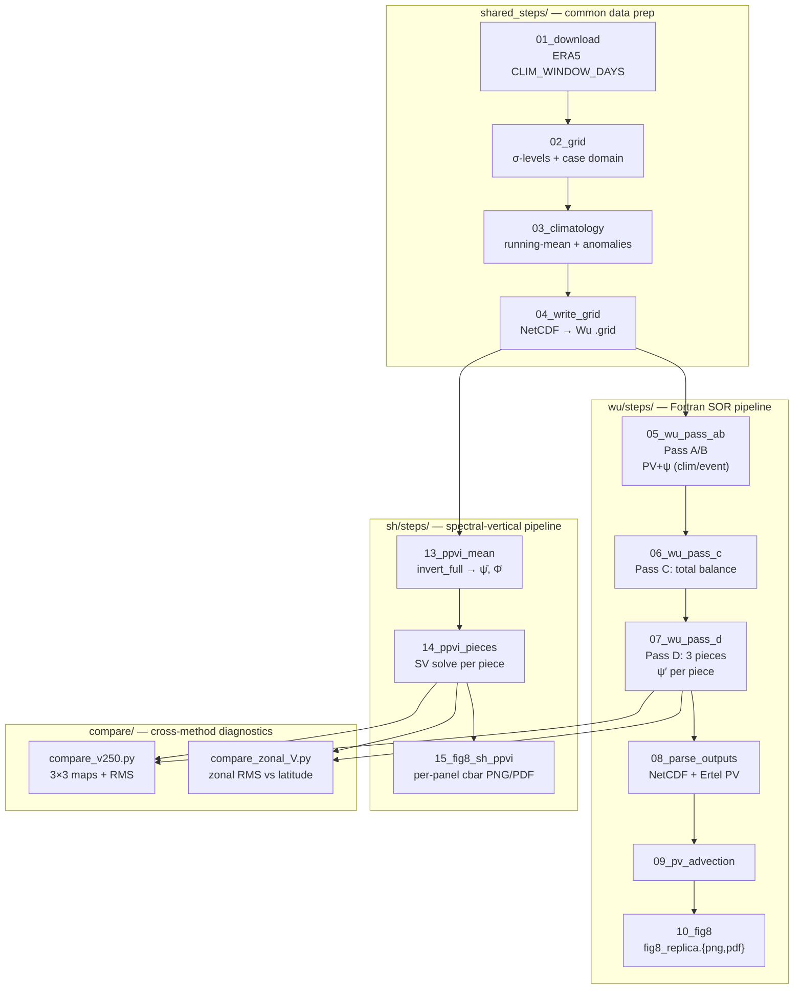

# Piecewise PV Inversion (PPVI) — Wu (Fortran) vs SH (spectral) tracks

Replicate Davis et al. (2022, J. Climate, Fig 8) for atmospheric blocking
events using **two parallel inversion backends**:

- **`wu/`** — the Wu/Davis F77 SOR-based piecewise PV inversion on a finite
  σ-coordinate box (the reference; bit-for-bit reproduction of Davis 2022).
- **`sh/`** — a spectral-vertical (SV) PPVI on the full NH spherical-harmonic
  grid. Diagonalised per SH degree via a 10×10 LU per wavenumber.

The two methods share data preparation (`shared_steps/`) and are compared
side-by-side in `compare/`.

> **Physics caveat.** The SH solver is currently an **approximation** of the
> Wu balance: it uses the β-plane thermal-wind link `δΦ ≈ f₀·δψ` and
> spatial-mean A,B per level to keep the system diagonal in spectral space.
> Empirically this produces induced winds ~10× weaker than Wu (see
> `data/figs/compare_v250.png`). See the TODO block in
> `sh/sh_ppvi/invert_piece.py` for the upgrade path.

## Minimal Requirements

- **Python**: micromamba env `fourcastnetv2` (xarray, scipy, cartopy, cdsapi, matplotlib)
- **Fortran**: `gfortran` (F77, `-std=legacy -O2 -fno-automatic`)
- **CDS API**: `~/.cdsapirc` for ERA5 downloads
- **HPC**: runs on dolma/momo (do NOT use `uv`, `uvx`, or `venv`)

## Quick Start

```bash
# 1. Edit root config.py — event date, region, resolution, clim window
vim config.py

# 2. Shared data prep (download ERA5 + climatology + Wu grid files)
for s in shared_steps/0[1-4]_*/; do
    micromamba run -n blocking python "$s"/*.py
 done

# 3a. Wu Fortran track  →  wu/steps/10_fig8/fig8_replica.png
for s in wu/steps/0[5-9]_*/ wu/steps/10_*/; do
    micromamba run -n blocking python "$s"/*.py
done

# 3b. SH-PPVI spectral track  →  sh/steps/15_fig8_sh_ppvi/fig8_sh_ppvi.png
for s in sh/steps/1[3-5]_*/; do
    micromamba run -n blocking python "$s"/*.py
done

# 4. Cross-method comparison figures  →  data/figs/compare_*.png
for f in compare/compare_*.py; do
    micromamba run -n blocking python "$f"
done
```

Each pipeline pulls config from a thin wrapper (`wu/config.py`, `sh/config.py`)
that re-exports the root `config.py`. `sh/config.py` additionally defines
`F0_DEG = 45.0` for the β-plane reference latitude.

## Workflow



## Step-by-Step

| # | Script | Input | Output | Role |
|---|--------|-------|--------|------|
| 01 | `download_era5.py` | CDS API | `data/era5/era5_YYYY-MM-DD_00Z.nc` (×N) + `z500_evolution_5panel.png` | Download `CLIM_WINDOW_DAYS` daily ERA5 snapshots covering the symmetric clim window. Polar 5-panel sanity plot uses dynamic dates from `config.CLIM_DATES`. |
| 02 | `grid_explanation.py` | (none) | `grid_explanation.png` | Diagnostic of σ-grid and case domain — explains levels, spacing, NX×NY layout. |
| 03 | `clim_11day_mean.py` | `data/era5/*.nc` | `data/clim/{mean_clim,event,anomaly}.nc` + `daily_z500_anomalies.png` | Running-mean climatology from the window; event = day at index `CLIM_WINDOW_DAYS//2`; anomaly = event − mean. |
| 04 | `write_grid_files.py` | `data/clim/*.nc` | `data/wu_in/{mean,event}.grid` | Convert NetCDF to Wu Fortran format `(10F8.1)` with H = Z/g [m], θ = potential temperature [K], U, V stacked across `NW` σ-levels. Each `NY=51`-row record is exactly 9 lines. |
| 05 | `wu_pass_ab.py` | `data/wu_in/{mean,event}.grid` | `data/wu_out/{meanq,eventq,meanh,eventh}` | Compile + run **Wu pass A** (climatology) and **pass B** (event) of `pvpialln_94UV` → Ertel PV + balanced ψ for each state. |
| 06 | `wu_pass_c.py` | mean + event outputs | `data/wu_out/event_bal.out` | **Wu pass C** (`qinvert21`) — refine event balanced ψ via SOR + nonlinear balance (`INLIN=0` always). |
| 07 | `wu_pass_d.py` | event − mean Q | `data/wu_out/event_pert.out` (×NPIECES) | **Wu pass D** (`qinvertp21`) — split anomaly Q into 3 vertical pieces and invert each as a perturbation about the mean state. |
| 08 | `parse_wu_outputs.py` | pass A–D outputs | `data/wu_out/pv_advection.nc` | Parse Fortran ASCII outputs back into a single NetCDF; compute reference Ertel PV directly from ERA5 (in PVU) for display. |
| 09 | `pv_advection.py` | `pv_advection.nc` | `pv_advection_all_pieces.png` | Compute and plot `−(u′·∂q/∂x + v′·∂q/∂y) × 86400` [PVU/day] for each piece. Top rows show `∂q/∂x` and `∂q/∂y` for diagnosis. |
| 10 | `fig8_replica.py` | `pv_advection.nc` | `data/figs/fig8_replica.{png,pdf}` | Final 3-panel cartopy replica of Davis (2022) Fig 8. |

## Wu Fortran Passes A / B / C / D

The Wu/Davis PPVI uses three Fortran programs (`pvpialln_94UV`, `qinvert21`,
`qinvertp21`) run in four "passes". All four are SOR-based inversions on a
rigid-lid `NY × NX × NW` σ-coordinate box; Dirichlet boundary conditions for ψ
come from `ψ = gH/f` on the outer frame.

| Pass | Fortran exe | Input grid | What it computes | Key output |
|------|-------------|------------|------------------|------------|
| **A** | `pvpialln_94UV` | `mean.grid` (clim H, θ, U, V) | Ertel PV `q̄ = −g·κ·c_p^3.5/P0 · π^(−5/2) · [(f+ζ)·∂θ/∂π − ∂u/∂π·∂θ/∂y + ∂v/∂π·∂θ/∂x]`; balanced ψ̄ from ∇²ψ = ζ via SOR with `ψ = gH/f` on the boundary. | `meanq`, `meanh` |
| **B** | `pvpialln_94UV` | `event.grid` (event H, θ, U, V) | Same equation, applied to event-day state → total Q on event. | `eventq`, `eventh` |
| **C** | `qinvert21` | mean state + event Q (total) | Refine the **total** balanced flow on the event day: alternate ∇²ψ = ζ SOR with the nonlinear balance equation (Charney) until both converge. `INLIN=0` keeps the nonlinear balance term off — required because the 250 hPa jet otherwise drives divergence. | `event_bal.out` |
| **D** | `qinvertp21` | mean state + (event − mean) Q split into `NPIECES=3` vertical pieces | **Piecewise perturbation** inversion: for each piece, holds the mean state as the linearisation reference and inverts only that piece's Q anomaly → one ψ′ per piece. Pieces sum to the total event ψ anomaly. | `event_pert.out` × `NPIECES` |

The Ertel-PV coefficient `COEF` in `pvpialln_94UV.f` contains a spurious factor
of 100 — see "Wu Q internal unit" below.

## Step 09 — PV advection geometry

The `pv_advection_all_pieces.png` figure has two rows of gradient bases on top
(`∂q/∂x`, `∂q/∂y`) and three rows of per-piece advection below. The reason:

**Why the gradient rows are needed first.** PV advection per piece is
`PVadv_p = −(u′_total · ∂q_p/∂x + v′_total · ∂q_p/∂y)`. The two gradients come
from different spherical-grid formulas with different edge behaviours, and the
advection product can mask sign or scaling errors in either gradient. Plotting
the bases first lets you confirm `cos(lat)` scaling, edge masking, and the sign
convention before trusting the advection panels below.

**How the gradient rows are computed.** With grid spacing `DLAT = DLON = 1.5°`,
`R_E = 2.0e7/π m`, `DP = R_E · radians(DLAT)`, `DL = R_E · radians(DLON)`,
and `AP[i] = cos(lat_i)`:

```python
# ∂q/∂y: centred in latitude. Array is indexed north-to-south, so
# (q[i-1] − q[i+1]) gives +∂q/∂y (toward the pole).
dqdy[1:-1, :] = (q[:-2, :] - q[2:, :]) / (2 * DP)

# ∂q/∂x: centred in longitude, scaled by cos(lat) of the row.
# AP[i] converts degree spacing to physical metres at that latitude.
dqdx[i, 1:-1] = (q[i, 2:] - q[i, :-2]) / (2 * DL * AP[i])

# First/last row & column inherit the Wu rigid-lid frame mask (NaN/0).
```

**How the lower (advection) rows are computed.** For each piece `p ∈ 1..NPIECES`
the perturbation winds `u′, v′` come from pass D's ψ′ for that piece, and:

```python
PVadv_p = -(u_total_prime * dq_p_dx + v_total_prime * dq_p_dy) * 86400.0  # PVU/day
```

Edge rows/columns inherit the NaN mask from the gradient bases above, so the
rigid-lid frame never contaminates the advection field.

## Wu Q internal unit (~340–600× PVU)

Wu's Fortran Q output is **not in PVU**. Trace through
[fortran/pvpialln_94UV.f](fortran/pvpialln_94UV.f):

- `pvpialln_94UV.f:121–123` — constants `CP = 1004.5`, `P0 = 1.E5` Pa, `KAP = 2/7`.
- `pvpialln_94UV.f:137` — `PI(K) = CP · PR(K)^KAP` (exner-like vertical coord; PR is σ).
- `pvpialln_94UV.f:463` — `COEF = 1.E2 * 1.E6 * 9.81 * KAP * (CP**3.5) / P0`.
- `pvpialln_94UV.f:470` — `Q = −COEF · PI(L)^(−5/2) · [ (f+ζ)·STB − wind-shear ]`.

The `1.E6` term is the legitimate PVU conversion (1 PVU = 10⁻⁶ K·m²·s⁻¹·kg⁻¹).
The extra **`1.E2`** is a stale hPa↔Pa rescale left over from an earlier
version in which `P0` was 1000 (hPa); when `P0` was promoted to `1.E5` (Pa,
line 122) the 100× should have been dropped, but wasn't. This produces a flat
**100× over-scaling** on every level, modulated by the `PI(L)^(−5/2)` factor
(smaller at upper σ, larger at lower σ) — hence the observed ~340–600× span
across the 3 pieces.

**Impact on results: none.** The SOR Poisson solve `∇²ψ = ζ` is linear in Q,
so any constant prefactor on Q rescales ψ identically and the final balanced
winds, heights, and PV advection plots are unaffected. Wu's Q is only used as
the inversion RHS; for display we re-derive Ertel PV in proper PVU directly
from ERA5 (Step 08).

The Fortran is **deliberately not patched** to preserve byte-for-byte
reproduction of Davis (2022) intermediate dumps. A future SH-based solver
track will use the corrected coefficient.

## Configuration

Edit **one file**: `config.py`. All step scripts import from it.

| Parameter | Default | Description |
|-----------|---------|-------------|
| `NX, NY` | 87, 51 | Horizontal grid |
| `DLAT, DLON` | 1.5, 1.5 | Grid spacing [°] |
| `LAT_N/S, LON_W/E` | 85.5/10.5, −169.5/−40.5 | Domain bounds |
| `PR` | [1.0, …, 0.2] | σ-levels (p/1000 hPa) |
| `EVENT_DATE` | 2025-01-08 | Event date |
| `CLIM_WINDOW_DAYS` | 30 | Symmetric running-mean window |
| `NPIECES` / `PIECES` | 3 / `[[1..3], [4..6], [7..NW]]` | Vertical pieces for pass D |
| `OMEGS / OMEGH` | 1.4 | SOR relaxation factors |
| `INLIN` | 0 | 0 = linear balance (stable); 1 = nonlinear (diverges) |
| `MAX_ITER / MAXT` | 5000 / 500 | SOR iteration caps |

## Directory Structure

```
pv_inversion/
├── config.py                    ← Root shared parameters
├── shared_steps/                ← 01_download … 04_write_grid (shared inputs)
├── wu/                          ← Wu Fortran SOR pipeline (self-contained)
│   ├── config.py                ← Thin wrapper (re-exports root config)
│   ├── fortran/                 ← F77 sources (binaries built in Step 05)
│   └── steps/                   ← 05_wu_pass_ab … 10_fig8
│       └── 10_fig8/fig8_replica.{png,pdf}
├── sh/                          ← SH-PPVI spectral-vertical pipeline
│   ├── config.py                ← Wrapper + F0_DEG = 45.0
│   ├── sh_ppvi/                 ← Python package (operators, charney, invert_*, tests)
│   └── steps/                   ← 13_ppvi_mean, 14_ppvi_pieces, 15_fig8_sh_ppvi
│       └── 15_fig8_sh_ppvi/fig8_sh_ppvi.{png,pdf}
├── compare/                     ← Cross-method comparison scripts
│   ├── compare_v250.py          ← Wu | SH | diff, 3×3 maps, RMS table
│   ├── compare_zonal_V.py       ← Zonal RMS vs latitude, per piece
│   └── ab_compare_wu_vs_sh.py   ← Legacy A/B test script
├── data/                        ← All shared I/O (NetCDFs)
│   ├── era5/  clim/  wu_in/  wu_out/  sh_ppvi/
│   └── figs/                    ← Cross-method figures only (per-method figs live next to scripts)
└── archive/                     ← Reference + retired material (never edited)
    ├── old_sh_mvp_steps/        ← Old SH MVP (steps 11–12, sh_solver.py)
    ├── old_sh_mvp_figs/         ← Old SH MVP figures
    ├── talia_tutorial/  ppvi/  case_jan2025_CA/
```

## Known Limits

- **Piece 3 noise**: rigid-lid SOR leaks gridpoint noise from the top BC to the
  250 hPa jet level. Mitigated by Gaussian σ=1.5 smoothing + 40 m/s wind cap
  applied in Python before plotting.
- **`INLIN=1`** diverges at the 250 hPa jet. Always use `INLIN=0`.
- **Top σ-spacing** must be uniform Δσ = 0.05 (300→250→200 hPa) or the SOR
  vertical operator goes unstable.
- **Wu Q** is rescaled ~340–600× PVU (see above) — internal only; plotting uses
  ERA5-derived Ertel PV in proper PVU.
- **Pole handling**: the Wu solver uses a rigid-lid frame and inflates
  gradients near the boundary. A future SH-based track will handle the pole
  analytically via spherical harmonics.

## SH-PPVI (spectral-vertical) backend  —  current performance

The SH track in `sh/` solves the linearised piecewise system in spherical
harmonic space, exploiting the fact that the horizontal Laplacian is diagonal
in SH (eigenvalue `λ_l = −l(l+1)/R²`). For each SH degree the vertical system
collapses to a 10×10 LU factorisation; no Picard iteration.

**Two simplifying approximations are made vs the Wu reference:**

1. **β-plane thermal-wind link**  `δΦ ≈ f₀·δψ` at `f₀ = 2Ω·sin(45°)`.
   Drops the full nonlinear-balance cross-term that Wu retains in
   `wu/fortran/qinvertp21_94.f` (subroutine `BALP`, lines 308–389).
2. **Spatial-mean A, B per level** (`A[k]`, `B[k]` are scalars, not 2-D fields).
   Wu uses spatially-varying `AVO(i,j,k)`, `STB(i,j,k)`. The mean reduction is
   what makes the operator diagonal in SH space.

**Empirical impact** (see `compare/compare_zonal_V.py` output):

| Latitude | Piece  |   Wu RMS V₂₅₀ |   SH RMS V₂₅₀ | SH / Wu |
|----------|--------|---------------|---------------|---------|
| 70.5°N   | upper  |    73.8 m/s   |    11.9 m/s   |  0.16   |
| 45°N     | upper  |    58.1 m/s   |     6.7 m/s   |  0.12   |
| 25.5°N   | upper  |    80.6 m/s   |     3.5 m/s   |  0.04   |
| 45°N     | middle |     3.5 m/s   |    0.07 m/s   |  0.02   |
| 45°N     | lower  |     4.3 m/s   |    0.01 m/s   |  0.002  |

SH-PPVI is consistently weaker — **not** specifically improved at the pole.
The SH backend does have one structural advantage: it is solved on the
full NH grid (0–90°N), avoiding Wu's lateral BC=0 artefacts at the patch
edge (85.5°N), but the magnitude under-prediction dominates. See the TODO
block in `sh/sh_ppvi/invert_piece.py` for the upgrade plan (relax
level-mean A,B; relax β-plane δΦ).

## Reference

- Davis, C.A. et al. (2022), *J. Climate*, JCLI-D-22-0674.1.
- Davis, C.A. & Emanuel, K.A. (1991), *Mon. Wea. Rev.*
- Wu, C.C. & Emanuel, K.A. (1995), *J. Atmos. Sci.*
- Talia tutorial: `archive/talia_tutorial/`
- Original PPVI code: `archive/ppvi/` (git submodule)
