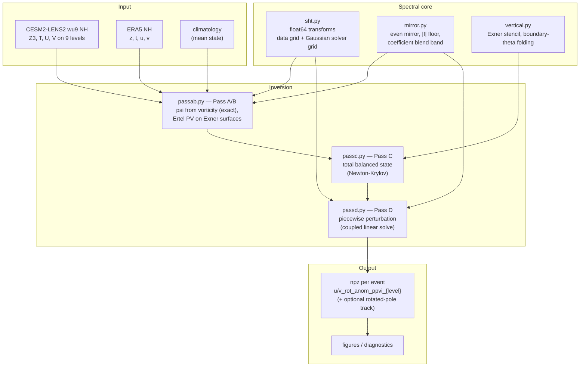
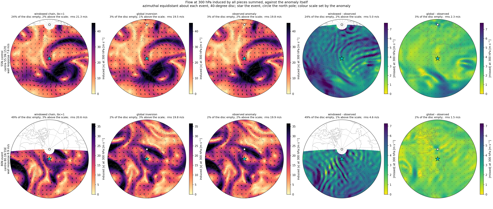

# pv_inversion_spherical

Piecewise potential-vorticity inversion (Davis & Emanuel 1991) solved on the whole sphere in
spherical harmonics, so an event centred anywhere — including across a pole — inverts without
lateral walls and without a metric singularity.

## Why

The existing engines (`pv_inversion` → `pvtend.ppvi`, and `pv_inversion_talia`) solve the same
equations by SOR on a limited-area latitude–longitude window with Dirichlet lateral walls. That
construction fails at high latitude for reasons that are structural, not numerical:

- the five-point stencil's north coefficient changes sign past 89°N (`cos(90.25°) < 0`), so the
  meridional operator becomes anti-diffusive;
- at 90°N single-precision `cos` returns ≈ −4.4e-8 instead of zero, giving a stencil diagonal of
  ≈ −1e15 and silent garbage rather than a crash;
- a rectangle continued past the pole folds: the longitudes on the far side are 180° wrong;
- the pole row is one physical point but `NX` grid columns, so a Dirichlet wall there imposes
  `NX` mutually inconsistent constraints on it;
- the lateral wall is not free — it carries 8–24 % of the answer as its own piece, and stripes the
  rows next to it.

Working globally removes all five at once. There is no wall, so there is no wall piece and no
`ibc` choice to make; the per-level pieces sum to the all-sources inversion exactly, by linearity.

## Method

Vertical coordinate is the Exner function Π = c_p (p/p₀)^κ, and hydrostatic balance ∂Φ/∂Π = −θ
closes the system. The two governing equations are the Charney nonlinear balance and the Ertel
potential vorticity written in Π coordinates. The perturbation (piecewise) form is linear in
(Φ′, ψ′) once the coefficients are frozen at the mean plus half the perturbation — the Davis
convention that makes pieces superpose — and is solved as one coupled system by a preconditioned
Krylov method. The preconditioner is separable: horizontal harmonics diagonalise the Laplacian, so
each spherical-harmonic coefficient leaves a tridiagonal problem in the vertical.

Two grid roles are kept apart, which is what makes the poles ordinary points:

| role | grid | what happens there |
|---|---|---|
| data | the file's own grid, poles included | scalar analysis and synthesis only — no metric factor is ever divided by |
| solver | Gauss–Legendre, no pole row | every product, coefficient and derivative |

Moving between them is exact for band-limited fields. Northern-hemisphere input is extended to the
sphere by an even mirror with `|f|`, which makes the operator commute with a reflection about the
equator; the solution is then exactly even and the northern half solves the northern problem under
a homogeneous Neumann equator.

## Pipeline


```mermaid
graph TD
    subgraph inputs["Input"]
        CESM["CESM2-LENS2 wu9 NH<br/>Z3, T, U, V on 9 levels"]
        ERA5["ERA5 NH<br/>z, t, u, v"]
        CLIM["climatology<br/>(mean state)"]
    end

    subgraph core["Spectral core"]
        SHT["sht.py<br/>float64 transforms<br/>data grid + Gaussian solver grid"]
        MIRROR["mirror.py<br/>even mirror, |f| floor,<br/>coefficient blend band"]
        VERT["vertical.py<br/>Exner stencil, boundary-theta folding"]
    end

    subgraph passes["Inversion"]
        AB["passab.py — Pass A/B<br/>psi from vorticity (exact),<br/>Ertel PV on Exner surfaces"]
        C["passc.py — Pass C<br/>total balanced state<br/>(Newton-Krylov)"]
        D["passd.py — Pass D<br/>piecewise perturbation<br/>(coupled linear solve)"]
    end

    subgraph out["Output"]
        NPZ["npz per event<br/>u/v_rot_anom_ppvi_{level}<br/>(+ optional rotated-pole track)"]
        FIG["figures / diagnostics"]
    end

    CESM --> AB
    ERA5 --> AB
    CLIM --> AB
    SHT --> AB
    MIRROR --> AB
    VERT --> C
    AB --> C
    C --> D
    SHT --> D
    MIRROR --> D
    D --> NPZ
    NPZ --> FIG
```

## Status

| phase | content | state |
|---|---|---|
| P0 | package scaffold, float64 spectral core, level tables, configuration | done |
| P1 | invariant horizontal operators, vertical stencil, hemisphere mirror | done |
| P2 | Pass D coupled linear solve, preconditioner, gauges | done |
| P3 | Pass A/B diagnostics and Pass C total inversion | done |
| P4 | piecewise driver, PV floors, data path and output contract | done |
| P5 | polar demonstration done; fifty-event comparison against the windowed chain done | done |
| P6 | batch driver written; one event 90-130 s at T84, tail events no longer stall | partial |
| P7 | taper as a weight on products (exact Newton), operator-consistent potential-vorticity source, ellipticity limiter as a safety net | done |

Measured so far (nine levels, T24, unless noted):

| quantity | value |
|---|---|
| spectral round-trip, pole-inclusive grids at full truncation | 5e-15 |
| nonlinear balance term, rotation invariance with a vortex on the pole | 1e-7 |
| pole-crossing vortex winds vs analytic | 2.5e-6 |
| preconditioned linear solve (manufactured right-hand side) | 32 GMRES iterations to 7e-11 at T24; 34 to 1e-10 at T63 |
| one operator application | 18 ms at T24, ~80 ms at T63 (one thread) |
| per-level and boundary pieces vs the all-sources solve | closes |
| nonlinear total inversion, no equatorial taper | 5 Newton steps, residual 1e-5 → 4e-20 |
| balance residual of the returned state, as geopotential height | below rounding |
| **walkthrough events** (ERA5 blocking 43.5 N, CESM Greenland 79 N), 96×192, T63 | 5 Newton steps each, no backtracking, no limiter; nine pieces in 44–61 Krylov iterations; closure 1.7e-8 and 5e-9 |
| **fifty CESM blocking peaks**, 128×256, T84, symmetric taper and operator-consistent source | 50 of 50 converged, median 4 Newton steps, the limiter needed by 2 of the 50; the six events that used to hit the 60-step cap converge in 4–5 steps with the balance equation as posed |
| fifty-event composite, unattributed flow at 400–200 hPa | see `examples/03_composite_comparison/README.md` for the current numbers against the windowed chain |
| what the pieces leave of the observed anomaly at 250 hPa | 3.1 of 21.1 m/s (15 %) on the ERA5 case, 4.2 of 20.3 (21 %) at 79 N: the anomaly of the unbalanced flow |

The nonlinear pass needs no solver of its own: both nonlinearities are quadratic, so the Jacobian
of the residual *is* the linearised operator of the piecewise pass evaluated at the current
iterate. For that to hold on real events the equatorial taper has to multiply the products the
quadratic terms are built from rather than one of their factors — otherwise the bilinear form is
not symmetric and Newton only halves the residual per step — and the potential-vorticity source
has to be evaluated with the operator's own stencils, so that the observed state satisfies the
potential-vorticity row exactly. With both, fifty winter events converge in four Newton steps with
the balance equation solved as posed. Where an iteration nevertheless meets a fold of the balance
row — the strain-dominated flank of a strong anticyclone, where the linearised row is not elliptic
— the deformation part of the row is limited from that point on, and the fact is reported
(`docs/math_note.md` §8). Getting quadratic convergence out of it took one non-obvious step — evaluating the
residual through the same code path as the Jacobian, using `F(x) = J_{x/2}[x] + F(0)`, which holds
exactly for a quadratic system. Evaluated from the pristine equations instead, the residual and
the Jacobian describe slightly different systems wherever a coefficient was tapered or floored,
and Newton stalls after roughly halving it.

## What a real event looks like

The walkthrough (`examples/01_walkthrough`) inverts the ERA5 blocking ridge of 8 January 2025
level by level. Induced rotational wind at 250 hPa, rms over the northern hemisphere, in m/s:

| piece | 1000 θ | 850 | 700 | 500 | 400 | 300 | 250 | 200 | 100 θ |
|---|---|---|---|---|---|---|---|---|---|
| rms | 3.8 | 2.1 | 1.8 | 1.9 | 3.2 | 7.2 | 10.3 | 11.7 | 14.7 |

Grouped, the surface carries 3.8, the three lower levels 3.7 and the upper levels with the top
boundary 20.7, against an observed anomaly of 21.1. Two things in that table are worth knowing
before reading any output:

**The 100 hPa boundary piece is the largest single piece** and largely cancels against the
upper-level pieces. That is the lid's doing, not the solver's: a planetary temperature anomaly at
the top boundary has a Rossby depth exceeding the domain, so its response is deep and almost
barotropic. On a window that response is not attributed at all; it is what a lateral wall absorbs.

**Levels 1000 and 100 are hydrostatic extensions, not solved levels**, exactly as in the Fortran
chain: the level next to them plus the boundary temperature's thermal-wind ghost.

## The polar case

`examples/02_polar_event/run.py` inverts two CESM events, a control at 55 N and one at 80 N, and
shows the 300 hPa flow induced by all pieces summed against the observed anomaly on a 40-degree
disc about each centre, for the windowed chain and for the global inversion. Both global
inversions converge in four Newton steps. The windowed chain cannot reach 24 % of the control's
disc and 49 % of the polar one's, and misses the observed anomaly by 5.0 and 4.6 m/s rms where it
does reach; the global inversion leaves 3 % and 2 % empty — the pole row, where the wind's
components are undefined — and misses by 2.2 and 1.3 m/s.



## Reading the output against the windowed pipeline's

The keys match the windowed contract, including the residual, which sits outside the piece
namespace (`u_rot_anom_residual_ppvi_3d`, not `..._ppvi_residual_3d`) so that a loader enumerating
pieces by prefix counts the same nine things in both files. `pv_anom_wu_3d` is the potential-vorticity
anomaly in SI, as it is there — written as the solver's own right-hand side instead it would differ
by a factor of 31.6 at 850 hPa falling to 11.3 at 200, a smooth vertical profile that reads as a
physical disagreement rather than a unit conversion.

Differences that are real, and must be reported rather than chased:

| what | size | where it shows |
|---|---|---|
| the curvature term the plane balance equation drops | ~2 % of the balance terms | everywhere, systematic and one-signed |
| no lateral wall | 8–24 % of the answer in the old files | the far field, and the 100 hPa piece here |
| whole-hemisphere against windowed anomaly | — | the far field of every piece |
| Earth radius: 6.371e6 here, 2e7/π = 6.366e6 there | 0.08 % | amplitudes, uniformly |
| `f*` with a 12° floor against signed `f` | ratio to \|f\|: 1.52 at 10.5°N, 1.17 at 20°, 1.08 at 30°, 1.04 at 45° | the subtropics |
| coefficient taper across 5–20°N | the quadratic terms carry 26 % of their weight at 10.5°N | the subtropics |
| column average divides by the *valid* weight, not the full sum | a stripe rather than a bias | rows where the old file writes 0.0 and this one writes NaN |
| levels 1000 and 100 are hydrostatic extensions | — | both codes, equally |

Two consequences worth stating plainly. Nothing about the subtropical part of a solution should be
quoted as physics without re-running with a smaller `f_floor_deg` and a narrower taper and
reporting both; narrowing the band makes the answer worse, not better, so the two configurations
bracket the answer rather than one correcting the other. And a patch centred below about 42°N
reaches south of the data itself: those rows are the mirror scaffold and come back empty rather
than filled with reflected weather.

## A term the plane form drops

Taking the divergence of the momentum equation gives, exactly and on any surface,
`lap(Phi) = div((f + zeta) grad psi) - lap(|grad psi|^2)/2`. On a sphere that is **not** the
textbook `div(f grad psi) + 2(psi_xx psi_yy - psi_xy^2)`: the Laplacian and the gradient no
longer commute, and the Bochner identity leaves

```
div(zeta grad psi) - lap(|grad psi|^2)/2 = 2 det(Hess psi) - |grad psi|^2 / a^2
```

So the Cartesian form used by the limited-area codes is the plane approximation, short by
`|V|^2/a^2` — a couple of percent of the balance terms in a midlatitude jet, systematic and
one-signed. This package solves the exact form; the difference is part of the expected gap in
any comparison against the Fortran chain, not a discrepancy to explain away.

## Layout

```
src/pvinv_sph/
  levels.py       pressure-level presets, Exner tables, the one PV unit conversion
  sht.py          float64 spherical-harmonic transforms and vector calculus
  sphere.py       invariant horizontal operators (balance term, cross terms, deformation)
  vertical.py     Exner second differences and the hydrostatic boundary ghosts
  mirror.py       hemisphere to sphere: even mirror, |f| floor, equatorial weight
  state.py        packing spectra into the solver's real vectors
  operator.py     the coupled linearised operator, its limiter and its right-hand side
  precond.py      separable preconditioner: one tridiagonal per spherical harmonic
  krylov.py       Krylov driver with iteration telemetry
  passab.py       Pass A/B: streamfunction and potential vorticity from the data
  prepare.py      hemisphere file to global solver state (fill, mirror, regrid)
  passc.py        Pass C: the total balanced state, by Newton-Krylov
  passd.py        Pass D: the pieces, one linear solve each
  qmin.py         potential-vorticity floors
  scale_split.py  planetary / eddy split of the upper source
  winds.py        induced winds and the two croppings around an event
  pipeline.py     one event end to end, with the output contract
  io.py           CESM readers and the atomic npz writer
  cli.py          batch driver over a catalogue
  config.py       solver configuration (grids, clamps, mirror, Krylov, Newton, PV floors)
tests/            the verification ladder
regression/       comparison against pvtend / the Fortran chain
examples/         01 walkthrough notebook, 02 polar event, 03 fifty-event composite
docs/             method.tex / method.pdf, math_note.md
```

## Running the tests

```bash
PYTHONPATH=src micromamba run -n blocking python -m pytest tests -q
```

## Reference

Davis, C. A. and K. A. Emanuel, 1991: Potential vorticity diagnostics of cyclogenesis.
*Monthly Weather Review*, **119**, 1929–1953.
