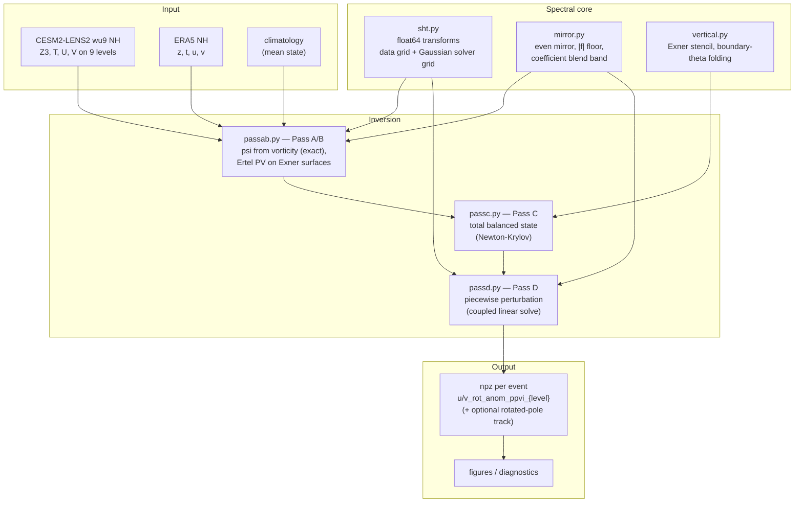

# pv_inversion_spherical

Piecewise potential-vorticity inversion (Davis & Emanuel 1991) solved on the whole sphere in
spherical harmonics, so an event centred anywhere — including across a pole — inverts without
lateral walls and without a metric singularity.

## Why

The existing engines (`pv_inversion` → `pvtend.ppvi`, and `pv_inversion_talia`) solve the same
equations by SOR on a limited-area latitude–longitude window with Dirichlet lateral walls. That
construction fails at high latitude for reasons that are structural, not numerical:

- the five-point stencil's north coefficient changes sign past 89°N (`cos(90.25°) < 0`), so the
  meridional operator becomes anti-diffusive;
- at 90°N single-precision `cos` returns ≈ −4.4e-8 instead of zero, giving a stencil diagonal of
  ≈ −1e15 and silent garbage rather than a crash;
- a rectangle continued past the pole folds: the longitudes on the far side are 180° wrong;
- the pole row is one physical point but `NX` grid columns, so a Dirichlet wall there imposes
  `NX` mutually inconsistent constraints on it;
- the lateral wall is not free — it carries 8–24 % of the answer as its own piece, and stripes the
  rows next to it.

Working globally removes all five at once. There is no wall, so there is no wall piece and no
`ibc` choice to make; the per-level pieces sum to the all-sources inversion exactly, by linearity.

## Method

Vertical coordinate is the Exner function Π = c_p (p/p₀)^κ, and hydrostatic balance ∂Φ/∂Π = −θ
closes the system. The two governing equations are the Charney nonlinear balance and the Ertel
potential vorticity written in Π coordinates. The perturbation (piecewise) form is linear in
(Φ′, ψ′) once the coefficients are frozen at the mean plus half the perturbation — the Davis
convention that makes pieces superpose — and is solved as one coupled system by a preconditioned
Krylov method. The preconditioner is separable: horizontal harmonics diagonalise the Laplacian, so
each spherical-harmonic coefficient leaves a tridiagonal problem in the vertical.

Two grid roles are kept apart, which is what makes the poles ordinary points:

| role | grid | what happens there |
|---|---|---|
| data | the file's own grid, poles included | scalar analysis and synthesis only — no metric factor is ever divided by |
| solver | Gauss–Legendre, no pole row | every product, coefficient and derivative |

Moving between them is exact for band-limited fields. Northern-hemisphere input is extended to the
sphere by an even mirror with `|f|`, which makes the operator commute with a reflection about the
equator; the solution is then exactly even and the northern half solves the northern problem under
a homogeneous Neumann equator.

## Pipeline


```mermaid
graph TD
    subgraph inputs["Input"]
        CESM["CESM2-LENS2 wu9 NH<br/>Z3, T, U, V on 9 levels"]
        ERA5["ERA5 NH<br/>z, t, u, v"]
        CLIM["climatology<br/>(mean state)"]
    end

    subgraph core["Spectral core"]
        SHT["sht.py<br/>float64 transforms<br/>data grid + Gaussian solver grid"]
        MIRROR["mirror.py<br/>even mirror, |f| floor,<br/>coefficient blend band"]
        VERT["vertical.py<br/>Exner stencil, boundary-theta folding"]
    end

    subgraph passes["Inversion"]
        AB["passab.py — Pass A/B<br/>psi from vorticity (exact),<br/>Ertel PV on Exner surfaces"]
        C["passc.py — Pass C<br/>total balanced state<br/>(Newton-Krylov)"]
        D["passd.py — Pass D<br/>piecewise perturbation<br/>(coupled linear solve)"]
    end

    subgraph out["Output"]
        NPZ["npz per event<br/>u/v_rot_anom_ppvi_{level}<br/>(+ optional rotated-pole track)"]
        FIG["figures / diagnostics"]
    end

    CESM --> AB
    ERA5 --> AB
    CLIM --> AB
    SHT --> AB
    MIRROR --> AB
    VERT --> C
    AB --> C
    C --> D
    SHT --> D
    MIRROR --> D
    D --> NPZ
    NPZ --> FIG
```

## Status

| phase | content | state |
|---|---|---|
| P0 | package scaffold, float64 spectral core, level tables, configuration | done |
| P1 | invariant horizontal operators, vertical stencil, hemisphere mirror | done |
| P2 | Pass D coupled linear solve, preconditioner, gauges | done |
| P3 | Pass A/B diagnostics and Pass C total inversion | done |
| P4 | piecewise driver, PV floors, data path and output contract | done |
| P5 | polar demonstration done; regression against the Fortran chain not started | partial |
| P6 | batch driver written; throughput not yet benchmarked at scale | partial |

Measured so far (nine levels, T24, unless noted):

| quantity | value |
|---|---|
| spectral round-trip, pole-inclusive grids at full truncation | 5e-15 |
| nonlinear balance term, rotation invariance with a vortex on the pole | 1e-7 |
| pole-crossing vortex winds vs analytic | 2.5e-6 |
| preconditioned linear solve (manufactured right-hand side) | 33 GMRES iterations to 6e-11 |
| one operator application | 18 ms |
| per-level and boundary pieces vs the all-sources solve | closes |
| nonlinear total inversion, no equatorial taper | 5 Newton steps, residual 1e-5 → 4e-20 |
| balance residual of the returned state, as geopotential height | below rounding |
| **real CESM event**, 96×192 solver grid, T63 | 119 s, 11 Newton steps, all nine pieces converged in 35–51 Krylov iterations |
| **closure on that event**, pieces against the all-sources solve | 1.4e-8; 0.0000 m/s rms against an 8.6 m/s signal |

The nonlinear pass needs no solver of its own: both nonlinearities are quadratic, so the Jacobian
of the residual *is* the linearised operator of the piecewise pass evaluated at the current
iterate. Getting quadratic convergence out of it took one non-obvious step — evaluating the
residual through the same code path as the Jacobian, using `F(x) = J_{x/2}[x] + F(0)`, which holds
exactly for a quadratic system. Evaluated from the pristine equations instead, the residual and
the Jacobian describe slightly different systems wherever a coefficient was tapered or floored,
and Newton stalls after roughly halving it.

## What a real event looks like

One CESM 6-hourly state against its climatology, decomposed level by level. The
attribution — each piece's projection onto the observed anomalous rotational wind
through 400–200 hPa — comes out where potential-vorticity thinking says it should:

| piece | 1000 | 850 | 700 | 500 | 400 | 300 | 250 | 200 | 100 |
|---|---|---|---|---|---|---|---|---|---|
| projection | −0.06 | +0.00 | +0.00 | +0.07 | +0.17 | +0.25 | +0.25 | +0.28 | −0.01 |

The upper-level potential-vorticity levels carry 94 % of it. Two things in that
table are worth knowing before reading any output:

**The 100 hPa boundary piece is large but nearly orthogonal to the event.** Its
amplitude reaches 30 m/s while its projection is −0.01, and it cancels against the
upper-level pieces. That is the lid's doing, not the solver's: CESM's temperature
anomaly at 100 hPa is 9.8 K rms, which the Exner factor turns into 19 K of
potential temperature, and an anomaly that large and that planetary has a Rossby
depth exceeding the domain — so its response is deep and almost barotropic. On a
window that response is not attributed at all; it is what a lateral wall absorbs.

**Levels 1000 and 100 are hydrostatic extensions, not solved levels**, exactly as
in the Fortran chain. Their values are the level next to them plus the boundary
temperature term, and the residual is correspondingly larger there.

## The polar case

`experiments/exp02_polar_cap/run.py` inverts the same state twice, around a centre
at 55°N and one at 88°N, and plots the 300 hPa piece's induced flow in both
croppings. Both converge in the same eleven Newton steps and the same two minutes;
the polar geographic box is 48 % empty because those rows are past the pole, and
the rotated frame is complete with the same peak amplitude as the mid-latitude
case (26.4 against 26.2 m/s).


## Reading the output against the windowed pipeline's

The keys match the windowed contract, including the residual, which sits outside the piece
namespace (`u_rot_anom_residual_ppvi_3d`, not `..._ppvi_residual_3d`) so that a loader enumerating
pieces by prefix counts the same nine things in both files. `pv_anom_wu_3d` is the potential-vorticity
anomaly in SI, as it is there — written as the solver's own right-hand side instead it would differ
by a factor of 31.6 at 850 hPa falling to 11.3 at 200, a smooth vertical profile that reads as a
physical disagreement rather than a unit conversion.

Differences that are real, and must be reported rather than chased:

| what | size | where it shows |
|---|---|---|
| the curvature term the plane balance equation drops | ~2 % of the balance terms | everywhere, systematic and one-signed |
| no lateral wall | 8–24 % of the answer in the old files | the far field, and the 100 hPa piece here |
| whole-hemisphere against windowed anomaly | — | the far field of every piece |
| Earth radius: 6.371e6 here, 2e7/π = 6.366e6 there | 0.08 % | amplitudes, uniformly |
| `f*` with a 12° floor against signed `f` | ratio to \|f\|: 1.52 at 10.5°N, 1.17 at 20°, 1.08 at 30°, 1.04 at 45° | the subtropics |
| coefficient taper across 5–20°N | reference vorticity 74 % removed at 10.5°N | the subtropics |
| column average divides by the *valid* weight, not the full sum | a stripe rather than a bias | rows where the old file writes 0.0 and this one writes NaN |
| levels 1000 and 100 are hydrostatic extensions | — | both codes, equally |

Two consequences worth stating plainly. Nothing about the subtropical part of a solution should be
quoted as physics without re-running with a smaller `f_floor_deg` and `blend=False` and reporting
how much of it survives. And a patch centred below about 42°N reaches south of the data itself:
those rows are the mirror scaffold and come back empty rather than filled with reflected weather.

## A term the plane form drops

Taking the divergence of the momentum equation gives, exactly and on any surface,
`lap(Phi) = div((f + zeta) grad psi) - lap(|grad psi|^2)/2`. On a sphere that is **not** the
textbook `div(f grad psi) + 2(psi_xx psi_yy - psi_xy^2)`: the Laplacian and the gradient no
longer commute, and the Bochner identity leaves

```
div(zeta grad psi) - lap(|grad psi|^2)/2 = 2 det(Hess psi) - |grad psi|^2 / a^2
```

So the Cartesian form used by the limited-area codes is the plane approximation, short by
`|V|^2/a^2` — a couple of percent of the balance terms in a midlatitude jet, systematic and
one-signed. This package solves the exact form; the difference is part of the expected gap in
any comparison against the Fortran chain, not a discrepancy to explain away.

## Layout

```
src/pvinv_sph/
  levels.py    pressure-level presets, Exner tables, the one PV unit conversion
  sht.py       float64 spherical-harmonic transforms and vector calculus
  sphere.py    invariant horizontal operators (balance term, cross terms, deformation)
  vertical.py  Exner second differences and the hydrostatic boundary ghosts
  mirror.py    hemisphere to sphere: even mirror, |f| floor, equatorial taper
  state.py     packing spectra into the solver's real vectors
  operator.py  the coupled linearised operator and its right-hand side
  precond.py   separable preconditioner: one tridiagonal per spherical harmonic
  krylov.py    Krylov driver with iteration telemetry
  passab.py    Pass A/B: streamfunction and potential vorticity from the data
  passc.py     Pass C: the total balanced state, by Newton-Krylov
  config.py    solver configuration (grids, clamps, mirror, Krylov, Newton, PV floors)
tests/         the verification ladder
regression/    comparison against pvtend / the Fortran chain
experiments/   exp01 low-latitude regression, exp02 polar cap
docs/          derivation notes
```

## Running the tests

```bash
PYTHONPATH=src micromamba run -n blocking python -m pytest tests -q
```

## Reference

Davis, C. A. and K. A. Emanuel, 1991: Potential vorticity diagnostics of cyclogenesis.
*Monthly Weather Review*, **119**, 1929–1953.
