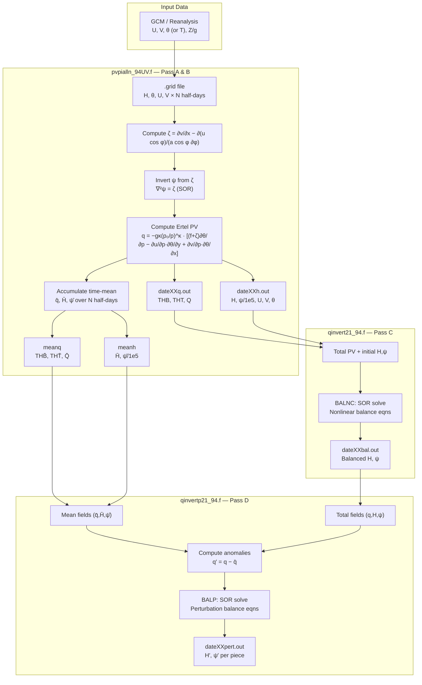

# Talia Tutorial — inv3d: Full PV Inversion Fortran Pipeline

> **Location:** `/net/flood/data2/users/x_yan/pv_inversion/archive/talia_tutorial/inv3d/`
> **Generated:** 2026-06-02
> **Purpose:** Complete reference for AI agents — math, code, boundary conditions, input/output formats, and workflow for the three Fortran programs implementing Davis & Emanuel (1991) nonlinear balance PV inversion (the "Davis paper" method), as maintained by C.-C. Wu.

---

## Table of Contents

1. [Overview](#1-overview)
2. [Flowchart](#2-flowchart)
3. [Mathematical Foundations](#3-mathematical-foundations)
4. [Program 1: `pvpialln_94UV.f` — PV Computation & Streamfunction Inversion](#4-program-1-pvpialln_94uvf)
5. [Program 2: `qinvert21_94.f` — Total PV Inversion (BALNC)](#5-program-2-qinvert21_94f)
6. [Program 3: `qinvertp21_94.f` — Perturbation PV Inversion (BALP)](#6-program-3-qinvertp21_94f)
7. [File Formats](#7-file-formats)
8. [Input Files Reference](#8-input-files-reference)
9. [Running the Pipeline](#9-running-the-pipeline)
10. [Python Correspondence (Wu Port)](#10-python-correspondence-wu-port)

---

## 1. Overview

The three Fortran programs implement **nonlinear balance PV inversion** following Chris Davis's formulation (Davis & Emanuel 1991, _Mon. Wea. Rev._). The code was maintained and extended by Chun-Chieh Wu (MIT) circa 1991–1994.

### The Three Programs

| Program | Purpose | Key Subroutine |
|---------|---------|---------------|
| `pvpialln_94UV.f` | Compute Ertel PV from U,V,θ,H on pressure levels; invert ψ from ζ (SOR); compute time-mean fields over many half-days | `main` (linear ψ inversion) |
| `qinvert21_94.f` | **Pass C** — Total PV inversion: solve nonlinear balance system (H, ψ) from full PV | `BALNC` |
| `qinvertp21_94.f` | **Pass D** — Perturbation PV inversion: solve for perturbation (H′, ψ′) from q′ piecewise | `BALP` |

### Domain & Grid

- **NL = 10** vertical levels (pressure: 1000, 850, 700, 500, 400, 300, 250, 200, 150, 100 hPa)
- **NY = 21** latitude points (increasing SOUTH; bizarre convention)
- **NX = 45** longitude points
- Typically ~2.5° × 2.5° resolution on a limited-area domain
- Supports **lat/lon** (`IMAP=1`) or **map-factor** (`IMAP=2`) coordinates

---

## 2. Flowchart



---

## 3. Mathematical Foundations

### 3.1 Vertical Coordinate

The vertical coordinate is the **Exner function** Π (called `PI` in the code, not to be confused with π = 3.14159…):

$$\Pi = C_p \left(\frac{p}{p_0}\right)^\kappa, \quad \kappa = \frac{R}{C_p} = \frac{2}{7}, \quad C_p = 1004.5 \text{ J kg}^{-1} \text{K}^{-1}, \quad p_0 = 10^5 \text{ Pa}$$

The code stores Π(k) for each pressure level PR(k):
```fortran
DATA PR/ 1., .85, .7, .5, .4, .3, .25, .2, .15, .1/   ! in bars (1 bar = 10⁵ Pa)
PI(K) = CP * (PR(K)**KAP) / DPI    ! nondimensionalized
```

where `DPI = 50` is a nondimensionalization constant (set to 500/NL in pvpialln).

### 3.2 Potential Temperature

From temperature T (in K, read from .grid file):

$$\theta = T \cdot \left(\frac{p_0}{p}\right)^\kappa = T \cdot \frac{C_p}{\Pi}$$

In `pvpialln_94UV.f`:
```fortran
TH(I,J,K) = TH(I,J,K) * CP / PI(K)
```

### 3.3 Ertel Potential Vorticity (PV)

The PV is computed on Π-surfaces (isobaric in Exner coordinates):

$$q = -g\kappa \left(\frac{p_0}{p}\right)^\kappa \left[ (f + \zeta) \frac{\partial\theta}{\partial p} - \frac{\partial u}{\partial p}\frac{\partial\theta}{\partial y} + \frac{\partial v}{\partial p}\frac{\partial\theta}{\partial x} \right]$$

In the code (`pvpialln_94UV.f`, L480+):
```fortran
COEF = 1.E2 * 1.E6 * 9.81 * KAP * (CP**3.5) / P0
! For each level L:
ZSHR = COEF * (PI(L)**(-2.5)) * (DU(I,J,L)*DTHY(I,J,L) - DV(I,J,L)*DTHX(I,J,L))
Q(I,J,L) = -COEF * (PI(L)**(-2.5)) * ((FC(I)+VOR(I,J,L)) * STB(I,J,L)) - ZSHR
```

where:
- `COEF` includes the $10^2$ factor (PV is stored in units of 0.01 PVU)
- `ZSHR` = shear term: $\partial\mathbf{v}/\partial p \cdot \nabla_p\theta$
- `STB` = static stability: $\partial\theta/\partial\Pi$
- `FC` = Coriolis parameter: $f = 2\Omega\sin\phi = 1.458\times10^{-4}\sin\phi$
- `VOR` = relative vorticity on the sphere

**Units of output PV:** 0.01 PVU (1 PVU = $10^{-6}$ K m² kg⁻¹ s⁻¹), so values in output files are ~O(100).

### 3.4 Relative Vorticity (Spherical)

$$\zeta = \frac{1}{a\cos\phi}\frac{\partial v}{\partial\lambda} - \frac{1}{a\cos\phi}\frac{\partial}{\partial\phi}(u\cos\phi)$$

In the code:
```fortran
VL  = (V(I,J+1,K) - V(I,J-1,K)) / (2.*DL*AP(I))
UPV = (AP(I-1)*U(I-1,J,K) - AP(I+1)*U(I+1,J,K)) / (2.*DP*AP(I))
VOR(I,J,K) = VL - UPV
```
where `AP(I) = cos(latitude)`, `DL = a·Δλ`, `DP = a·Δφ`.

### 3.5 Streamfunction from Vorticity (∇²ψ = ζ)

The streamfunction ψ satisfies the 2D Poisson equation on the sphere:

$$\nabla^2\psi = \frac{1}{a^2\cos^2\phi}\frac{\partial^2\psi}{\partial\lambda^2} + \frac{1}{a^2\cos\phi}\frac{\partial}{\partial\phi}\left(\cos\phi\frac{\partial\psi}{\partial\phi}\right) = \zeta$$

**Boundary conditions (lateral):** Dirichlet — ψ integrated along the boundary from the corner using the divergence theorem (Davis eq. 2.40):

$$\psi_{boundary} = \int \left[\bar{u} \cdot a\,d\phi + \bar{v} \cdot a\cos\phi\,d\lambda\right]$$

where $\bar{u}, \bar{v}$ are corrected for the domain-mean divergence dsum. Starting from $\psi(1,1) = H(1,1) \cdot g/f$:

```fortran
! Corner → integrate east along southern edge
psi(i+1,1,k) = psi(i,1,k) + (dsum + (u(i,1,k)+u(i+1,1,k))/2.) * DP
! Integrate north along eastern edge
psi(NY,j+1,k) = psi(NY,j,k) + (dsum + (v(NY,j,k)+v(NY,j+1,k))/2.) * DL * AP(NY)
! Integrate west along northern edge (backwards)
psi(i-1,NX,k) = psi(i,NX,k) + (dsum - (u(i,NX,k)+u(i-1,NX,k))/2.) * DP
! Integrate south along western edge (backwards)
psi(1,j-1,k) = psi(1,j,k) + (dsum - (v(1,j,k)+v(1,j-1,k))/2.) * DL * AP(1)
```

**Interior: SOR iteration** with `ω = 1.75`, threshold = $5\times10^4$ m²/s:
```fortran
Lapsi = (1/(DL*DL)) * [A(I,1)*psi(I-1,J,K) + A(I,2)*psi(I,J-1,K) + A(I,3)*psi(I,J,K)
                      + A(I,4)*psi(I,J+1,K) + A(I,5)*psi(I+1,J,K)]
RS = Lapsi - VOR(I,J,K)
psi(I,J,K) = psi_old - omega * RS / A(I,3) * (DL*DL)
```

### 3.6 Nonlinear Balance Equations (Davis 1991)

The core theoretical framework is the system of two equations:

**Equation (1) — Balance equation (divergence of momentum eqn):**

$$\nabla^2\Phi = \nabla\cdot(f\nabla\psi) + 2\left[\frac{\partial^2\psi}{\partial x^2}\frac{\partial^2\psi}{\partial y^2} - \left(\frac{\partial^2\psi}{\partial x\partial y}\right)^2\right]$$

In the code notation (`delsq(H) = div(f grad(S)) + 2(Sxx·Syy − Sxy²)`):
- `H` = geopotential Φ (nondimensionalized)
- `S` = streamfunction ψ (nondimensionalized)
- The Jacobian term $2(\psi_{xx}\psi_{yy} - \psi_{xy}^2)$ captures nonlinear advection

**Equation (2) — PV equation:**

$$q = (f + \nabla^2\psi)\frac{\partial^2\Phi}{\partial\Pi^2} - \frac{\partial^2\psi}{\partial x\partial\Pi}\frac{\partial^2\Phi}{\partial x\partial\Pi} - \frac{\partial^2\psi}{\partial y\partial\Pi}\frac{\partial^2\Phi}{\partial y\partial\Pi}$$

where $q$ is the Ertel PV mapped to Π-coordinates.

**Coupled system:** Adding (1) and (2) gives an equation for ψ; subtracting (2) from (1) gives a 3D equation for Φ.

### 3.7 Adding and Subtracting Strategy

**From the BALNC header comments (qinvert21_94.f, L20–45):**

> Adding (1) and (2) gives an equation for S (streamfunction):
> $$\nabla^2 S^{(new)} = \text{Stuff}(H^{(new)}, q, S^{(old)})$$
> where $S^{(old)}$ is the previous solution (or initial guess) for S and is used to evaluate the nonlinear term. This is the **2-D Poisson equation**.
>
> Subtracting (2) from (1) gives a 3-D equation for H (geopotential):
> $$\nabla^2 H + (f + \nabla^2 S^{(new)})\frac{\partial^2 H}{\partial\Pi^2} = \text{Stuff}(H^{(old)}, S^{(new)}, q)$$

### 3.8 Nondimensionalization

Key constants set in the code:

| Symbol | Fortran | Value | Meaning |
|--------|---------|-------|---------|
| $f_0$ | `FF` | $10^{-4}$ s⁻¹ | Reference Coriolis |
| $L$ | `LL` | $a \cdot \Delta\lambda \cdot \pi/180$ | Horizontal length scale |
| $\Theta_0$ | `THO` | $f_0^2 L^2 / DPI$ | Reference θ scale |
| $DPI$ | `DPI` | 50 | Nondimensional Π increment |
| $H_{nd}$ | `HND` | $DPI \cdot THO / g$ | Height scale (~28.3 m for 1.5° grid) |

**Nondimensionalization rules:**

$$\Pi_{nd} = \Pi / DPI$$

$$H_{nd} = H_{phys} \cdot \frac{g}{THO \cdot DPI}$$

$$S_{nd} = \psi_{phys} \cdot \frac{g}{THO \cdot DPI} = \frac{\psi_{phys}}{HND}$$

$$q_{nd} = \frac{\Pi_{nd}^{2.5} \cdot q_{phys}}{100 \cdot QCONST}$$

where:
```fortran
QCONST = 1.E6 * KAP * GG * CP * FF * THO / (P0 * DPI)
PIF(K) = (PI(K)/CP)**2.5   ! (Π/Cp)^(2.5)
```

**Scale factors for output:** Before writing, multiply back: `H_out = H_nd * DPI * THO / GG`, `SI_out = SI_nd * DPI * THO / GG`.

---

## 4. Program 1: `pvpialln_94UV.f`

### 4.1 Purpose

Compute Ertel PV from U, V, θ, H on pressure levels for multiple half-days (e.g., 12-hourly data). Also:
- Invert ψ from ζ via ∇²ψ = ζ (linear SOR)
- Compute time-mean fields (q̄, H̄, ψ̄) over all half-days
- Write per-time output files and mean output files

### 4.2 Input

- **`nhalfday`** — number of input half-days (e.g., 20 for 10 days at 12-hourly)
- **`nhalfdayo`** — number of output half-days to write
- **`nhalfout(nn)`** — list of which half-day indices to output
- **`.grid` files** — one per half-day, each containing:
  - Header (8 floats): year, month, day, hour, dlon, dlat, NX, NY
  - NW levels of H (geopotential height, meters): `format(10F8.1)`
  - NW levels of θ (temperature in K, converted to θ internally): `format(10F8.1)`
  - NW levels of U (m/s): `format(10F8.1)`
  - NW levels of V (m/s): `format(10F8.1)`

### 4.3 Output Files

**Per half-day (`dateXXq.out` and `dateXXh.out`):**

| File | Content |
|------|---------|
| `dateXXq.out` | Header, then: THB (lower bdy θ), THT (upper bdy θ), Q(2:NW-1) (PV × 0.01 PVU) |
| `dateXXh.out` | Header, then: H(1:NW), ψ/1e5 (1:NW), U(1:NW), V(1:NW), θ(1:NW) |

**Mean files (`meanq`, `meanh`):**
Same format averaged over `nhalfday` inputs.

### 4.4 Key Numerical Steps

1. **Linear ψ inversion:** ψ on boundaries via divergence-theorem integration, then SOR interior solve (ω=1.75, thr=5×10⁴).
2. **PV computation:** Eq. 3.3 above with finite differences.
3. **ψ scaling:** Output ψ is divided by $10^5$ so its numeric values are comparable to H (meters). The BALNC solver re-multiplies by $10^5$.

### 4.5 SOR for Linear ψ Inversion

```fortran
! Laplacian coefficients on sphere:
A(I,1) = SIGM*SIGM * APM(I)/AP(I)     ! north (i-1)
A(I,2) = 1.0 / (AP(I)*AP(I))           ! west  (j-1)
A(I,3) = -(2 + SIGM*SIGM*AP(I)*(APM(I)+APP(I))) / (AP(I)*AP(I))  ! center
A(I,4) = 1.0 / (AP(I)*AP(I))           ! east  (j+1)
A(I,5) = SIGM*SIGM * APP(I)/AP(I)      ! south (i+1)
! where SIGM = dlon/dlat, AP = cos(φ)

Lapsi = (1/DL²) * Σ A(I,m)*ψ(neighbor)
RS = Lapsi - ζ
ψ_new = ψ_old - ω * RS / A(I,3) * DL²
```

**Boundary conditions:** None enforced during SOR; boundaries are fixed from the initial integration and never updated in the loop.

---

## 5. Program 2: `qinvert21_94.f` — Total PV Inversion

### 5.1 Purpose

Solve the **nonlinear balance system** for total H and ψ fields given total PV q. This is **Pass C** — it refines the balanced fields from the initial guess (Pass A/B outputs).

### 5.2 Input (interactive)

```
MAX         ! max SOR iterations per level (e.g., 200)
MAXT        ! max total (H-ψ) cycles (e.g., 200)
OMEGAS      ! SOR overrelaxation for ψ (e.g., 1.85)
OMEGAH      ! SOR overrelaxation for H (e.g., 1.75)
PRT         ! underrelaxation for H,ψ between cycles (e.g., 0.5)
THR         ! convergence threshold (meters dimensional, e.g., 0.1)
FNM(1)      ! init file (H + ψ from Pass A/B, e.g., '03021312h.out')
FNM(2)      ! PV file (q from Pass A/B, e.g., '03021312q.out')
FNM(5)      ! output file (balanced fields, e.g., '03021312bal.out')
IMAP        ! 1 = lat/lon, 2 = map-factor
QMIN        ! minimum PV (PVU), e.g., 0.01
INF         ! 1 = init is H/ψ, 2 = init is θ/ψ
```

### 5.3 Output

`dateXXbal.out` — Header + NL levels of H (m) + NL levels of ψ (×10⁵ m²/s).

### 5.4 The BALNC Subroutine — Detailed Math

#### 5.4.1 Laplacian Coefficients (5-point stencil)

Same `A(I,1:5)` as pvpialln, representing the discretized 2D Laplacian on the sphere scaled by `1/DL²`:

$$\nabla^2 f \approx \frac{1}{DL^2} \sum_{m=1}^{5} A(i,m) \cdot f_{neighbor(m)}$$

where `A(I,3)` is the diagonal (center) coefficient.

#### 5.4.2 Vertical Finite Differences

Second derivatives on the Π-grid with non-uniform spacing:

```
BB(K) = -2 / ((PE(K+1)-PE(K)) * (PE(K)-PE(K-1)))          ! ∂²/∂Π² diagonal
BH(K) =  2 / ((PE(K+1)-PE(K)) * (PE(K+1)-PE(K-1)))        ! ∂²/∂Π² upper off-diag
BL(K) =  2 / ((PE(K)-PE(K-1)) * (PE(K+1)-PE(K-1)))        ! ∂²/∂Π² lower off-diag
DPI2(K) = (PE(K+1) - PE(K-1)) / 2                          ! 2ΔΠ for 1st derivatives
```

Stability: `STB = BH·H(k+1) + BL·H(k-1) + BB·H(k)` approximates ∂²Φ/∂Π². Floor-clamped to 0.0001 if negative.

#### 5.4.3 RHS of the ψ Equation (Adding (1)+(2))

Compute the RHS for the 2D Poisson eq. at each level K:

```fortran
! Horizontal second derivatives of ψ
SXX = S(j+1) + S(j-1) - 2*S(j)      ! ∂²ψ/∂x²
SYY = S(i-1) + S(i+1) - 2*S(i)      ! ∂²ψ/∂y²
SXY = (S(i-1,j+1)-S(i-1,j-1)-S(i+1,j+1)+S(i+1,j-1))/4  ! ∂²ψ/∂x∂y

! Beta term (variation of f)
BETAS = 0.25*(σ²(f_{i-1,j}-f_{i+1,j})(ψ_{i-1}-ψ_{i+1}) + (f_{i,j+1}-f_{i,j-1})(ψ_{i,j+1}-ψ_{i,j-1}))

! Cross-derivative terms (H-ψ coupling)
ZHP = H(i-1,j,k+1)-H(i+1,j,k+1)-H(i-1,j,k-1)+H(i+1,j,k-1)  ! ≈ 4·Δy·ΔΠ·H_{yΠ}
ZHL = H(i,j+1,k+1)-H(i,j-1,k+1)-H(i,j+1,k-1)+H(i,j-1,k-1)  ! ≈ 4·Δx·ΔΠ·H_{xΠ}
ZSP = same for ψ
ZSL = same for ψ
ZL = ZPL(I) * ZHL * ZSL / DPI2(K)²
ZP = ZPP(I) * ZHP * ZSP / DPI2(K)²

! Nonlinear Jacobian term
ZNL = NLCO(I,J) * (SXX*SYY - SXY²) + BETAS

! Assemble RHS
DELH = ∇²H (5-point Laplacian of H)
RHST = QE - FCM*STB + DELH - ZNL + ZL + ZP
RHS(I,J,K) = RHST / (FCO + FR*STB)
```

Where:
- `FCM` = $f/M^2$ (map-factor-scaled Coriolis, = f for lat/lon)
- `FCO` = f (raw Coriolis)
- `FR` = `FRC` = 1.0 (from nondimensionalization)
- `QE` = nondimensionalized PV q
- `STB` = ∂²H/∂Π²
- `ZL, ZP` = cross-derivative coupling terms between H and ψ
- `ZNL` = nonlinear Jacobian term

#### 5.4.4 SOR Iteration for ψ (2-D, level by level)

```fortran
! At each interior point (I,J,K):
RS = Σ A(I,m)*S(neighbor) - RHS(I,J,K)    ! residual
DSI = -OMEGS * RS / A(I,3)                ! SOR correction
S(I,J,K) = S(I,J,K) + DSI
! Convergence: |DSI| < THRS for ALL points at ALL interior levels
```

#### 5.4.5 RHS of the H (Φ) Equation (Subtracting (2) from (1))

```fortran
! After ψ converged, compute:
VOR = ∇²ψ (5-point Laplacian)
! Clamp if f+ζ < 0.0001
ASI = FCM + FR*VOR                                ! absolute vorticity
SXX, SYY, SXY as above
BETAS as above
! New ZL, ZP with updated H and S

RHA = FCO*VOR + NLCO*(SXX*SYY - SXY²) + BETAS
RH = RHA + QE + ZL + ZP
```

#### 5.4.6 SOR Iteration for H (3-D, simultaneous across levels)

**Key innovation:** The H-equation has vertical coupling through ASI·BH·H(k+1) and ASI·BL·H(k-1). These are treated explicitly (lagged) in the SOR:

**Interior level k (2 < k < NL-1):**
```fortran
RS = ∇²H (5-pt) + ASI*BB*H(k) + ASI*(BH*H(k+1) + BL*H(k-1)) - RH
H_new = H_old - OMEGH * RS / (AC(I,3) + ASI*BB)
```

**Lower boundary (k=2) — Neumann-type via θ boundary condition:**
```fortran
! BL(K=2) is folded into diagonal; θ_B forcing via THA(I,J,1)/DPI2(K)
RS = ∇²H + ASI*(BB+BL)*H(2) + ASI*(BH*H(3) + THA/DPI2) - RH
H_new = H_old - OMEGH * RS / (AC(I,3) + ASI*(BB+BL))
```

**Upper boundary (k=NL-1):**
```fortran
! BH(K=NL-1) folded into diagonal; θ_T forcing via -THA(I,J,2)/DPI2(K)
RS = ∇²H + ASI*(BB+BH)*H(NL-1) + ASI*(BL*H(NL-2) - THA/DPI2) - RH
H_new = H_old - OMEGH * RS / (AC(I,3) + ASI*(BB+BH))
```

**Boundary θ treatment:** `THA(I,J,1)` = lower boundary θ (at Π between k=1 and k=2), `THA(I,J,2)` = upper boundary θ (at Π between k=NL-1 and k=NL). These enter via the hydrostatic relation:
$$\frac{\partial\Phi}{\partial\Pi} = -\theta$$

So at the lower boundary, H(1) is set from H(2) + θ_B·(Π(2)−Π(1)), and similarly at the top.

#### 5.4.7 Convergence & Underrelaxation

After each SOR cycle converges for both ψ and H:

```fortran
! Underrelax (PART = PRT):
S_new = PART * S_new + (1-PART) * S_old
H_new = PART * H_new + (1-PART) * H_old
```

**Total convergence:** When BOTH ψ converges in 1 iteration AND H converges in 1 iteration (i.e., the fields stop changing), the total Picard iteration stops.

**Boundary levels** (k=1 and k=NL): Not solved. Set from interior via hydrostatic:
```fortran
H(1) = H(2) + THA(1)*(PE(2)-PE(1))
S(1) = S(2) + (THA(1)-THSB(1))*(PE(2)-PE(1))
H(NL) = H(NL-1) - THA(2)*(PE(NL)-PE(NL-1))
S(NL) = S(NL-1) - (THA(2)-THSB(NL-1))*(PE(NL)-PE(NL-1))
```
where `THSB` is the area-average of θ at that level.

#### 5.4.8 Lateral Boundary Conditions

**Dirichlet** — the boundary values of H and ψ are **never updated** during the SOR iterations. They are fixed to whatever was read from the init file. The loops run only over `I=2,NY-1` and `J=2,NX-1`.

### 5.5 Negative PV Handling

```fortran
QNEW = PIF(K) * QMIN / QCONST        ! nondimensional minimum
! For each point: if Q < QNEW, set Q = QNEW
! Compute QDIF = (sum of added PV) / (N - N_clamped)
! Subtract QDIF from all unclamped points to preserve volume integral
```

---

## 6. Program 3: `qinvertp21_94.f` — Perturbation PV Inversion

### 6.1 Purpose

Solve for **perturbation** H′ and ψ′ from perturbation PV q′ = q − q̄. Supports **piecewise inversion** — solving for only a subset of PV levels at a time.

### 6.2 Input (interactive)

```
OMEGAS, OMEGAH     ! overrelaxation (e.g., 1.85, 1.75)
PRT                ! underrelaxation (e.g., 0.8)
THRSH              ! convergence threshold (e.g., 0.1 m)
TSCAL              ! θ scaling (usually 1.0)
QSCAL              ! q scaling (usually 1.0)
FNM(1)             ! mean q file (e.g., 'meanq')
FNM(2)             ! mean H/ψ file (e.g., 'meanh')
FNM(3)             ! total q file (e.g., '03021312q.out')
FNM(4)             ! total H/ψ file (e.g., '03021312bal.out')
FNM(5)             ! output pert file (e.g., '03021312pert.out')
IMAP               ! 1=lat/lon, 2=map
INLIN              ! 1=include nonlinear terms (retained in coefficients)
IQD                ! 1=conditional q' (e.g., only in saturated air)
IBC                ! 0=homogeneous Dirichlet, 1=total perturbation BC, 2=read from file
NHO, HOUT(1:NHO)   ! # and list of output H levels
NSIO, SIOUT(1:NSIO)! # and list of output ψ levels
NOUT               ! # of inversions to perform
! For each inversion:
NMLV, QLV(1:NMLV)  ! # and list of PV levels (1=lower θ, 2:NL-1=q levels, NL=upper θ)
```

### 6.3 The BALP Subroutine — Perturbation Balance

#### 6.3.1 Linearization with Optional Nonlinear Retention

The perturbation equations are **linear** in H′ and ψ′, but with coefficients that depend on the mean state. **INLIN=1** (recommended) folds the nonlinear terms into modified mean variables:

```fortran
! Redefine "mean" to include half the perturbation:
CNLIN = 0.5
MB = MB + CNLIN * MP    ! "mean" H = actual mean + 0.5 * perturbation
SB = SB + CNLIN * SP    ! "mean" ψ = actual mean + 0.5 * perturbation
MP = MP - MB_orig       ! perturbation H = total - actual mean
SP = SP - SB_orig       ! perturbation ψ = total - actual mean
```

This ensures that the sum of piecewise solutions equals the total perturbation (the nonlinear Jacobian $J(\psi', \psi')$ is correctly partitioned).

#### 6.3.2 Precomputed Mean-State Coefficients

```fortran
! For each interior level K:
SLL = ZNC(I,J) * (SB(j+1)+SB(j-1)-2*SB(j))     ! ≈ ∂²ψ̄/∂y² · coeff
SPP = ZNC(I,J) * (SB(i-1)+SB(i+1)-2*SB(i))     ! ≈ ∂²ψ̄/∂x² · coeff
AVO = FCM + FR * ∇²ψ̄                             ! absolute vorticity of mean
SLP = ZNC(I,J) * (SB(i-1,j+1)-SB(i-1,j-1)-SB(i+1,j+1)+SB(i+1,j-1))/2  ! ∂²ψ̄/∂x∂y
STB = BH*HB(k+1) + BL*HB(k-1) + BB*HB(k)         ! ∂²H̄/∂Π²

! Coefficient for ψ-equation:
ASI = BB*AVO / (FR*STB*AC(I,3))
BSI = 1 + ASI*FCO

! Coefficient for H-equation:
BI = FCO*AC(I,3) - 2*(SLL+SPP)
APHI = BI / (FR*STB*AC(I,3))
```

#### 6.3.3 RHS of Perturbation ψ Equation

```fortran
! Cross terms from mean state:
R1BS = (SB(j+1,k+1)-SB(j-1,k+1)-SB(j+1,k-1)+SB(j-1,k-1))/(4*DPI2(K))
R1BH = (HB(j+1,k+1)-HB(j-1,k+1)-HB(j+1,k-1)+HB(j-1,k-1))/(4*DPI2(K))
R2BS = (SB(i-1,k+1)-SB(i+1,k+1)-SB(i-1,k-1)+SB(i+1,k-1))/(4*DPI2(K))
R2BH = (HB(i-1,k+1)-HB(i+1,k+1)-HB(i-1,k-1)+HB(i+1,k-1))/(4*DPI2(K))

! Same for perturbation fields (primed quantities):
R1PS, R1PH, R2PS, R2PH (same stencil applied to SP, HP)

! RHS assembly:
RHS = QP + FR * [(R1BS*R1PH + R1BH*R1PS)/(AP²) + σ²*(R2BS*R2PH + R2BH*R2PS)]

SRHS = (RHS - AVO*(BH*HP(k+1) + BL*HP(k-1))) / (FR*STB)
     + ASI * (Σ A(I,m)*HP(neighbor) except center)
```

#### 6.3.4 SOR for Perturbation ψ (2-D, level by level)

```fortran
RSA = Σ A(I,m)*SP(neighbor) + A(I,3)*SP(I,J,K)   ! ∇²ψ'
SXX, SYY, SXY as before
BETAS = σ²*(f(i-1)-f(i+1))*(SP(i-1)-SP(i+1))/4 + (f(j+1)-f(j-1))*(SP(j+1)-SP(j-1))/4

RS = BSI*RSA + ASI*(BETAS + SLL*SYY + SPP*SXX - SLP*SXY) - SRHS

SP_new = SP_old - OMEGS*RS / (BSI*AC(I,3) - 2*ASI*(SLL+SPP))
! Convergence: |ΔSP| < THRS
```

#### 6.3.5 RHS of Perturbation H (Φ) Equation

```fortran
RH1 = (2/AC(I,3))*(SLL+SPP) * Σ A(I,m)*SP(neighbor except center)
BETAS as above
RH2 = BETAS + SLL*(SP(i-1)+SP(i+1)) + SPP*(SP(j-1)+SP(j+1))
    - SLP*(SP(i-1,j+1)-SP(i-1,j-1)-SP(i+1,j+1)+SP(i+1,j-1))/4

HRHS = APHI*RHS + RH1 + RH2
```

#### 6.3.6 SOR for Perturbation H (3-D)

Same structure as BALNC but with `APHI*AVO` replacing `ASI`:

**Interior:**
```fortran
RS = ∇²HP + APHI*AVO*BB*HP(k) + APHI*AVO*(BH*HP(k+1)+BL*HP(k-1)) - HRHS
HP_new = HP_old - OMEGH*RS / (AC(I,3) + APHI*BB*AVO)
```

**Lower boundary (k=2):** BB+BL folded; + `TP(I,J,1)/DPI2(K)` forcing
**Upper boundary (k=NL-1):** BB+BH folded; − `TP(I,J,2)/DPI2(K)` forcing

Where `TP` is the perturbation boundary θ (only nonzero if that level was selected in `QLV`).

#### 6.3.7 Piecewise PV Selection

The `QLV` array specifies which PV anomalies to include:
- `QLV = 1` → include lower boundary θ′
- `QLV = 2,...,NL-1` → include q′ at that interior level
- `QLV = NL` → include upper boundary θ′

If `NMLV = NL` (all levels), use the full perturbation. Otherwise, only nonzero q′ and θ′ for selected levels; all others are set to zero (homogeneous Neumann for H and ψ at boundaries).

#### 6.3.8 Lateral Boundary Conditions for Perturbation

| IBC | Condition |
|-----|-----------|
| 0 | **Homogeneous Dirichlet:** HP = 0, SP = 0 on all boundaries |
| 1 | **Total perturbation BC:** HP = H − Σ(previous pieces), SP = ψ − Σ(previous pieces) — this is what makes the sum of pieces equal the total |
| 2 | **Read from file:** Nesting — boundary values read from a coarser-grid inversion |

#### 6.3.9 Accumulation of Pieces

```fortran
! After each inversion, accumulate:
SISUM = SISUM + SP
HTSUM = HTSUM + HP
! These sums are used to compute the residual for IBC=1 boundary conditions.
```

---

## 7. File Formats

### 7.1 `.grid` File (Input to pvpialln)

```
FORMAT(10F8.1)
```

Structure (per file):
1. **Header:** 8 reals = [year, month, day, hour, dlon(°), dlat(°), NX, NY]
2. **H (geopotential height, m):** NW levels × NY rows of NX values
3. **T (temperature, K):** NW levels × NY rows of NX values (converted to θ internally)
4. **U (zonal wind, m/s):** NW levels × NY rows of NX values
5. **V (meridional wind, m/s):** NW levels × NY rows of NX values

The header values in the example:
```
20.0  -150.0  70.0  -40.0  2.5  2.5  45  21
```
meaning: day=20, lon_start=210°E (−150°W = 210°E), lat_start=70°N, lon_end=−40°E (320°E), Δlon=2.5°, Δlat=2.5°, NX=45, NY=21.

### 7.2 `.out` Files (Output/Input)

All `.out` files share the same header format (8 reals from the original .grid header), then the data.

**Q output file (`dateXXq.out`):**
```
FORMAT(13F10.2)
```
1. NY rows of lower boundary θ (THB), then NY rows of upper boundary θ (THT)
2. For each interior level K=2,...,NW-1: NY rows of Q (PV in 0.01 PVU)

**H/ψ output file (`dateXXh.out` or `dateXXbal.out`):**
```
FORMAT(13F10.2)
```
1. NW levels of H (geopotential height, meters): K=1→NW, each NY rows
2. NW levels of ψ/1e5 (streamfunction scaled to look like H): K=1→NW, each NY rows
3. (In `dateXXh.out` only:) NW levels of U, V, θ

### 7.3 Perturbation Output (`dateXXpert.out`)

```
FORMAT(13F10.2)
```
Written by BALP:
1. Selected output levels of perturbation H′ (meters): for each HOUT level, NY rows
2. Selected output levels of perturbation ψ′ (×10⁵ m²/s): for each SIOUT level, NY rows

### 7.4 Mean Files (`meanq`, `meanh`)

Same format as their per-time counterparts, averaged over `nhalfday` inputs.

---

## 8. Input Files Reference

### 8.1 `pvpialln_in` (Pass A & B)

```
meanq                 ! output: mean q file
meanh                 ! output: mean H/ψ file
20                    ! nhalfday = number of input half-days
03021200.grid         ! .grid file 1
03021212.grid         ! .grid file 2
03021300.grid         ! ...
03021312.grid
03021400.grid
03021412.grid
03021500.grid
03021512.grid
03021600.grid
03021612.grid
03021700.grid
03021712.grid
03021800.grid
03021812.grid
03021900.grid
03021912.grid
03022000.grid
03022012.grid
03022100.grid
03022112.grid         ! .grid file 20
20                    ! nhalfdayo = number of output half-days
1                     ! nn=1: output halfday index
03021200q.out         !   output q file
03021200h.out         !   output H/ψ file
2                     ! nn=2: output halfday index
03021212q.out         ! ...
03021212h.out
...                   ! (continues for all 20 output days)
```

### 8.2 `qinvert21_94_in` (Pass C — Total Balance)

```
200                   ! MAX = max iterations per SOR level
200                   ! MAXT = max total (outer) iterations
1.85                  ! OMEGAS = SOR ω for ψ
1.75                  ! OMEGAH = SOR ω for H
0.5                   ! PRT = underrelaxation
0.1                   ! THR = convergence threshold (m)
'03021312h.out'       ! init file (H + ψ from Pass B)
'03021312q.out'       ! PV file
'03021312bal.out'     ! output balanced file
1                     ! IMAP = 1 (lat/lon)
0.01                  ! QMIN (PVU)
1                     ! INF = 1 (init is H/ψ, not θ/ψ)
```

### 8.3 `qinvertp21_94_in` (Pass D — Perturbation Inversion)

```
1.85                  ! OMEGAS
1.75                  ! OMEGAH
0.8                   ! PRT = underrelaxation
0.1                   ! THRSH = convergence (m)
1.                    ! TSCAL = θ scaling
1.                    ! QSCAL = q scaling
'meanq'               ! mean q
'meanh'               ! mean H/ψ
'03021312q.out'       ! total q
'03021312bal.out'     ! total H/ψ (from Pass C)
'03021312pert.out'    ! output perturbation file
1                     ! IMAP = 1
1                     ! INLIN = 1 (retain nonlinear terms)
0                     ! IQD = 0 (no conditional q')
10,1,2,3,4,5,6,7,8,9,10  ! NHO=10, HOUT = all levels
10,1,2,3,4,5,6,7,8,9,10  ! NSIO=10, SIOUT = all levels
3                     ! NOUT = 3 inversions
1,1                   ! Inv 1: NMLV=1, QLV=1 (lower θ only)
0                     ! IBC = 0 (homogeneous Dirichlet)
2,2,3                 ! Inv 2: NMLV=2, QLV=2,3 (q at levels 2-3)
0                     ! IBC = 0
7,4,5,6,7,8,9,10      ! Inv 3: NMLV=7, QLV=4-10 (q at levels 4-10)
0                     ! IBC = 0
```

---

## 9. Running the Pipeline

### 9.1 Compilation

```bash
# Compile all three programs with gfortran (legacy F77):
gfortran -std=legacy -O2 -fno-automatic -o pvpialln pvpialln_94UV.f
gfortran -std=legacy -O2 -fno-automatic -o qinvert qinvert21_94.f
gfortran -std=legacy -O2 -fno-automatic -o qinvertp qinvertp21_94.f
```

The example compilation command from `f77_example`:
```bash
f77 -o xtrct_usa xtrct_usa.f $GEMLIB/*.a $GEMLIB/gemlib.a
```

### 9.2 Execution Order

```bash
# Step 1: Pass A & B — Compute PV and mean state
./pvpialln < pvpialln_in
# Outputs: meanq, meanh, dateXXq.out, dateXXh.out for each half-day

# Step 2: Pass C — Total PV inversion (nonlinear balance)
./qinvert < qinvert21_94_in
# Output: dateXXbal.out

# Step 3: Pass D — Perturbation PV inversion (piecewise)
./qinvertp < qinvertp21_94_in
# Output: dateXXpert.out
```

### 9.3 Important Constants

| Constant | Value | Description |
|----------|-------|-------------|
| `CP` | 1004.5 J/kg/K | Specific heat at constant pressure |
| `R` | 287.0 J/kg/K | Gas constant for dry air |
| `KAP` | 2/7 | R/Cp |
| `GG` | 9.81 m/s² | Gravity |
| `FF` | 1×10⁻⁴ s⁻¹ | Reference Coriolis parameter |
| `P0` | 1×10⁵ Pa | Reference pressure |
| `DPI` | 50 (qinvert) or 500/NL (pvpialln) | Nondimensional Π-scale |
| `MI` | 9999.90 | Missing value indicator |

### 9.4 Grid Size Changes

If you change `NX`, `NY`, or `NL`, you **must** change the `PARAMETER` statements in:
- The main program of each `.f` file
- The `BALNC` subroutine (inside `qinvert21_94.f`)
- The `BALP` subroutine (inside `qinvertp21_94.f`)

---

## 10. Python Correspondence (Wu Port)

The modern Python port lives at `/net/flood/data2/users/x_yan/pv_inversion/wu/`. Key correspondences:

| Fortran File | Python Module(s) | Notes |
|-------------|-----------------|-------|
| `pvpialln_94UV.f` | `wu/steps/05_wu_pass_ab/wu_pass_ab.py` | Pass A (clim) + Pass B (event) — PV computation |
| `qinvert21_94.f` — `BALNC` | `wu/balance.py` → `balnc()` | Pass C — Total balance. **Currently a stub** (returns identity). |
| `qinvertp21_94.f` — `BALP` | `wu/balance.py` → `balp()` | Pass D — Perturbation balance. **Currently a stub.** |
| `pvpialln` — PV formula | `wu/pv_calc.py` → `compute_pv()` | Pass A/B PV computation (working) |
| `pvpialln` — linear ψ | `wu/sor.py` → `invert_streamfunction_sor()` | Linear ∇²ψ = ζ inversion (working) |
| Non-dim scaling | `wu/nondim.py` | BB, BH, BL, QCONST, HND (verified) |

### 10.1 Known Issues in Python Port

From the user memory (`wu-sh-ppvi-gotchas.md`):

1. **Shear sign in `compute_pv()`:** Python had wrong sign; Fortran `pvpialln_94UV.f` L480 uses `+∂u/∂Π·∂θ/∂y − ∂v/∂Π·∂θ/∂x`. **FIXED** (2026-06-02).

2. **θ convention in `read_wu_grid()`:** `.grid` files store raw T (K), not θ. Fortran converts via `θ = T·Cp/Π`. Python `read_wu_grid` now does the same. **FIXED**.

3. **BALNC full Python implementation is a stub** — returns identity. Needs complete rewrite.

4. **S_nd scaling:** Correct formula is `S_nd = ψ_phys / (1e5 * HND)` — NO `FF` factor. The `1e5` comes from the Fortran output scaling (ψ written as ψ/1e5 to match H magnitude).

5. **BB/BH/BL must be built from PI_WU** (Π from pressure), not raw PI_VALS. `PI_WU = Cp·(p/p0)^κ/DPI`.

---

## Appendix A: Key Equations Summary

### A.1 Linear ψ Inversion (Pass A/B)
$$\nabla^2\psi = \zeta, \quad \psi|_{\partial\Omega} \text{ from divergence theorem}$$

### A.2 Ertel PV on Π-surfaces (Pass A/B)
$$q = -\frac{g\kappa}{p_0^\kappa} p^\kappa \left[(f+\zeta)\frac{\partial\theta}{\partial p} - \frac{\partial\mathbf{v}}{\partial p}\cdot\nabla_p\theta\right]$$

### A.3 Balance Equations (Pass C — BALNC)

**ψ-equation** (add (1)+(2)):
$$\nabla^2\psi = \frac{q - f\frac{\partial^2\Phi}{\partial\Pi^2} + \nabla^2\Phi - 2J(\psi_x,\psi_y) + \text{cross-terms}}{f + \frac{\partial^2\Phi}{\partial\Pi^2}}$$

**Φ-equation** (subtract (2) from (1)):
$$\nabla^2\Phi + (f+\nabla^2\psi)\frac{\partial^2\Phi}{\partial\Pi^2} = f\nabla^2\psi + 2J(\psi_x,\psi_y) + q + \text{cross-terms}$$

where $J(A,B) = A_{xx}B_{yy} - A_{xy}^2$ (simplified notation).

### A.4 Perturbation Equations (Pass D — BALP)

Linearized about the mean state $(\bar{\Phi}, \bar{\psi})$:

$$\nabla^2\psi' + \text{coeffs}(\bar{\Phi},\bar{\psi}) \cdot \psi' = q' + \text{cross-terms}(\bar{\Phi},\bar{\psi},\Phi',\psi')$$

$$\nabla^2\Phi' + \text{coeffs}(\bar{\Phi},\bar{\psi})\frac{\partial^2\Phi'}{\partial\Pi^2} = \text{RHS}(\bar{\Phi},\bar{\psi},\psi',q')$$

With optional retention of the $\psi'$-$\psi'$ Jacobian via `INLIN=1` (mean state augmented with half the perturbation).

---

## Appendix B: SOR Parameters Reference

| Parameter | Typical Value | Effect |
|-----------|--------------|--------|
| `OMEGAS` | 1.85 | Overrelaxation for ψ (higher = faster but less stable) |
| `OMEGAH` | 1.75 | Overrelaxation for H (slightly lower for stability) |
| `PRT` | 0.5 (total) / 0.8 (pert) | Underrelaxation between Picard cycles |
| `THR` | 0.1 m | Convergence threshold (dimensional meters) |
| `MAX` | 200 | Max SOR iterations per level |
| `MAXT` | 200 (total) / 400 (pert) | Max outer Picard cycles |

---

*Document generated from the source Fortran code, inline comments by Chris Davis and C.-C. Wu, the README, instructions.md, session memory, and user memory (wu-sh-ppvi-gotchas.md).*
