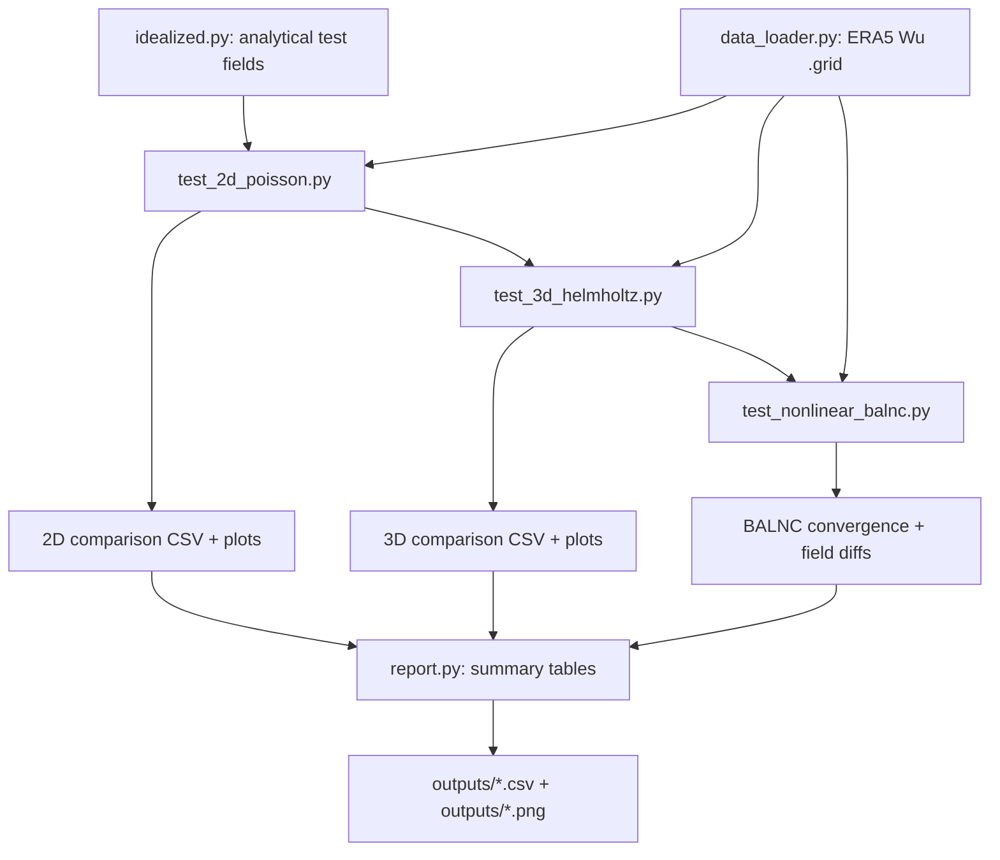

# test_poisson — Poisson/Helmholtz Solver Benchmarks for PV Inversion

Comparative benchmarks of 2-D and 3-D Poisson/Helmholtz solvers for the
nonlinear PV inversion problem.  All solvers are tested on identical
idealised and ERA5 data to quantify:

- **Residual** — how well ∇²ψ ≈ rhs is satisfied
- **Pole closure** — error at |lat| > 80° vs interior
- **Convergence rate** — iterations to reach tolerance
- **Stability** — max under-relaxation before blow-up (3-D case)

## Solvers Under Test

| Family | Method | 2D Poisson | 3D Helmholtz | Implementation |
|--------|--------|------------|--------------|----------------|
| **Wu SOR** | Fortran red-black SOR | ✅ | ✅ | `wu/fortran/qinvert21_94.f` (reference) |
| **wu_python** | numba red-black SOR | ✅ | ✅ | `wu_python/core/sor_solver.py` |
| **xinvert** | numba SOR (general-elliptic) | ✅ | ✅ | `xinvert.invert_Poisson` / `xinvert.invert_omega` |
| **xinvert MG** | xinvert multi-grid | ✅ | — | `xinvert.invert_MultiGrid` |
| **Spectral SH** | pyspharm spherical harmonics | ✅ | ✅ (lagged) | `test_poisson/sh/solver.py` → `pvtend.sh_ops` |
| **pvtend FFT** | FFT-λ + tridiagonal-φ | ✅ | — (per-level) | `pvtend.helmholtz.solve_poisson_spherical_fft` |

## Workflow



## Quick Start

```bash
cd /net/flood/data2/users/x_yan/pv_inversion

# Run all benchmarks
micromamba run -n blocking pytest test_poisson/ -v

# Run only 2-D Poisson tests
micromamba run -n blocking pytest test_poisson/test_2d_poisson.py -v

# Run with plots
micromamba run -n blocking python test_poisson/report.py
```

## Directory Structure

```
test_poisson/
├── README.md              ← this file
├── config.py              ← shared configuration
├── conftest.py            ← pytest fixtures
├── idealized.py           ← analytical test functions
├── data_loader.py         ← ERA5 data loading
├── sh/                    ← spectral (pyspharm) backend wrappers
│   ├── __init__.py
│   └── solver.py          ← Poisson + Helmholtz via pvtend.sh_ops
├── test_2d_poisson.py     ← 2-D solver comparison
├── test_3d_helmholtz.py   ← 3-D Helmholtz comparison
├── test_nonlinear_balnc.py← full BALNC with swappable backends
├── report.py              ← generate summary tables & plots
└── outputs/               ← benchmark results (CSV, PNG)
```

## Metrics

| Metric | Formula | Meaning |
|--------|---------|---------|
| L² error | ‖ψ − ψ_exact‖₂ / ‖ψ_exact‖₂ | Overall accuracy |
| L∞ error | max|ψ − ψ_exact| | Worst-case point error |
| Residual | ‖∇²ψ − ζ‖₂ | How well the PDE is satisfied |
| Pole error | ‖ψ_err( |lat| > 80°) ‖₂ | Degradation near poles |
| Wall time | elapsed seconds | Computational cost |
| Iterations | # SOR / outer loops | Convergence speed |
