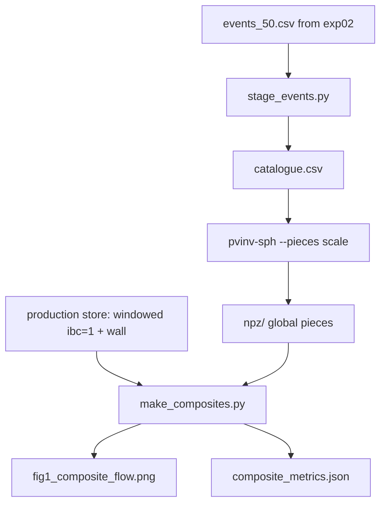

# exp03_global_vs_windowed

A reproduction of `pvtend/experiments/exp02_nested_ppvi` with the second scheme
replaced. That experiment asked whether nesting one window inside another reduces
the share of the flow that a limited-area inversion has to attribute to its own
lateral walls; the answer was that it does, from 0.078 to 0.061, and that it
cannot go further because the production window's band is fixed. This one asks
what happens when the boundary is removed instead of moved.

* **Windowed**, as production runs it: the Wu/Davis Fortran chain on a fixed
  10.5–85.5°N band with a ±90° longitude window centred on the event, lateral
  condition `ibc=1`, the wall response carried as its own piece, then cropped to
  the event-centred patch.
* **Global**: the same event inverted on the whole sphere, no boundary and
  therefore no wall, then cropped to the same patch by the same code.

Both decompose the same balanced perturbation into the same four sources, so the
comparison is of attribution, not of skill. The wall is merged with the residual
in the figure, both being the part not attributed to a potential-vorticity source.

## Files

| file | role |
|---|---|
| `events_50.csv` | exp02's event list, copied unchanged so the populations are identical |
| `stage_events.py` → `catalogue.csv` | resolves each event to a state file, a step index and a climatology slot, by matching timestamps rather than computing them |
| `npz/peak/dh=+0/` | the global inversions (`pvinv-sph … --pieces scale`) |
| `make_composites.py` → `composites.npz`, `composite_metrics.json`, `fig1_composite_flow.png` | common-mask composites and the shares |

The production store is read and never written.

## Run

The package is not installed into the environment, so `src` goes on the path:

```bash
cd /net/flood/data2/users/x_yan/pv_inversion_spherical
PYTHONPATH=src micromamba run -n blocking python -m pvinv_sph.cli \
    examples/03_composite_comparison/catalogue.csv \
    --out-dir examples/03_composite_comparison/npz/peak/dh=+0 \
    --workers 50 --pieces scale --newton-max-steps 60
```

`--pieces scale` is not the default and the two decompositions write disjoint key
sets, so a directory must not hold both. `--newton-max-steps` is raised from its
default of 20 because a few events need more than thirty; the wall clock of the
whole run is set by the slowest event, not by the event count, so more workers
than events buys nothing.

## Pipeline



## Three things done differently from exp02, because the rows now come from
## different codes

**Only the three-dimensional keys are read.** The two column averages do not share
a convention: the windowed pipeline divides by the full weight sum, so a column
with no valid level at all comes out as an exact zero rather than as missing. That
difference would appear as a stripe at the band edge and read as physics. The
average is recomputed here once, for both, dividing by the weight that was
actually valid.

**One weight set and one denominator.** The event's own geopotential height
weights both rows. The two codes reconstruct the observed anomaly slightly
differently — measured over these fifty events, 3.0 m/s apart on a 20.1 m/s
signal, pattern correlation 0.99, from different mirror parities, truncations and
precisions — so the production reconstruction is used as the single reference and
absolute amplitudes are reported alongside the shares.

**The truncation was checked, not assumed.** Going from T84 to T127 moves every
piece's share by at most 0.010 while costing 3.7× the time (3.2 → 11.7 minutes per
event), so the comparison runs at T84.

The scripts that established these numbers -- a truncation sweep, a study of where
the nonlinear iteration stops when it hits its step cap, and a check that the
windowed driver reproduces production's geometry -- were one-off and have been
removed. What they found is recorded where it will be read: the truncation figure
above, the step cap raised to sixty with the final increment now in the output
metadata, and the wall-counting correction now built into `windowed.py`.
