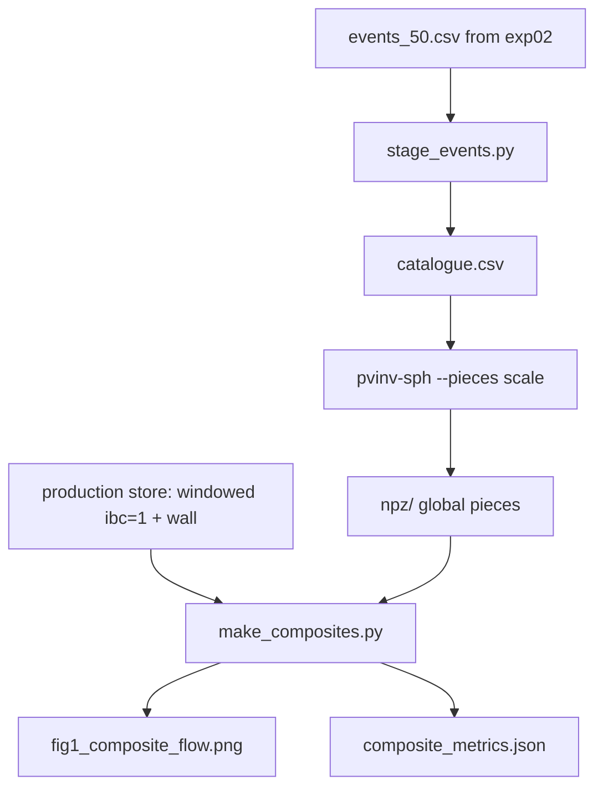

# exp03_global_vs_windowed

A reproduction of `pvtend/experiments/exp02_nested_ppvi` with the second scheme
replaced. That experiment asked whether nesting one window inside another reduces
the share of the flow that a limited-area inversion has to attribute to its own
lateral walls; the answer was that it does, from 0.078 to 0.061, and that it
cannot go further because the production window's band is fixed. This one asks
what happens when the boundary is removed instead of moved.

* **Windowed**, as production runs it: the Wu/Davis Fortran chain on a fixed
  10.5–85.5°N band with a ±90° longitude window centred on the event, lateral
  condition `ibc=1`, the wall response carried as its own piece, then cropped to
  the event-centred patch.
* **Global**: the same event inverted on the whole sphere, no boundary and
  therefore no wall, then cropped to the same patch by the same code.

Both decompose the same balanced perturbation into the same four sources, so the
comparison is of attribution, not of skill. The wall is merged with the residual
in the figure, both being the part not attributed to a potential-vorticity source.

## Files

| file | role |
|---|---|
| `events_50.csv` | exp02's event list, copied unchanged so the populations are identical |
| `stage_events.py` → `catalogue.csv` | resolves each event to a state file, a step index and a climatology slot, by matching timestamps rather than computing them |
| `npz/peak/dh=+0/` | the global inversions (`pvinv-sph … --pieces scale`) |
| `make_composites.py` → `composites.npz`, `composite_metrics.json`, `fig1_composite_flow.png` | common-mask composites and the shares |

The production store is read and never written.

## Run

The package is not installed into the environment, so `src` goes on the path:

```bash
cd /net/flood/data2/users/x_yan/pv_inversion_spherical
PYTHONPATH=src micromamba run -n blocking python -m pvinv_sph.cli \
    examples/03_composite_comparison/catalogue.csv \
    --out-dir examples/03_composite_comparison/npz/peak/dh=+0 \
    --workers 25 --pieces scale --newton-max-steps 60
```

`--pieces scale` is not the default and the two decompositions write disjoint key
sets, so a directory must not hold both. Two options that used to need setting
now default to what this experiment wants: `--krylov-maxiter` is 800, and
`--pv-source` is `operator`, which evaluates the potential-vorticity source with
the inversion's own stencils rather than the limited-area code's centred
differences. `--newton-max-steps 60` is kept on the command line only as a
ceiling; no event approaches it. Forty-five of the fifty converge in four Newton
steps and three in five; two meet a fold of the balance row, bring the
deformation limiter in, and finish in nine and ten. The fifty inversions took
12 minutes on 25 workers, set by those two.

## Pipeline



## Three things done differently from exp02, because the rows now come from
## different codes

**Only the three-dimensional keys are read.** The two column averages do not share
a convention: the windowed pipeline divides by the full weight sum, so a column
with no valid level at all comes out as an exact zero rather than as missing. That
difference would appear as a stripe at the band edge and read as physics. The
average is recomputed here once, for both, dividing by the weight that was
actually valid.

**One weight set and one denominator.** The event's own geopotential height
weights both rows. The two codes reconstruct the observed anomaly slightly
differently — measured over these fifty events, 3.0 m/s apart on a 20.1 m/s
signal, pattern correlation 0.99, from different mirror parities, truncations and
precisions — so the production reconstruction is used as the single reference and
absolute amplitudes are reported alongside the shares.

**The truncation was checked, not assumed.** Going from T84 to T127 moves every
piece's share by at most 0.010 while costing 3.7× the time (3.2 → 11.7 minutes per
event), so the comparison runs at T84.

The scripts that established these numbers -- a truncation sweep, a study of where
the nonlinear iteration stops when it hits its step cap, and a check that the
windowed driver reproduces production's geometry -- were one-off and have been
removed. What they found is recorded where it will be read: the truncation figure
above, the final increment and the posed-equation residuals now in the output
metadata, and the wall-counting correction now built into `windowed.py`.

## Results

Composite over the fifty events, 400-200 hPa, rms of the induced flow on the
common mask, in m/s (`composite_metrics.json`). The reference anomaly is
10.14 m/s in the production reconstruction and 10.12 m/s in the global one.

| source | windowed | global | global - windowed |
|---|---:|---:|---:|
| surface theta | 3.45 | 3.03 | -0.41 |
| lower PV (850-500) | 2.66 | 2.61 | -0.05 |
| upper PV, planetary | 7.56 | 8.65 | +1.08 |
| upper PV, eddy | 6.74 | 6.86 | +0.12 |
| wall | 0.79 | 0 | -0.79 |
| not attributed (wall + residual) | 1.09 | 0.26 | -0.83 |

Removing the boundary moves the flow from the unattributed part and the surface
into the planetary upper-level piece; the eddy and lower-level pieces barely
change. The global residual, 0.26 m/s or 2.6 percent of the anomaly, is what
the four pieces leave of the observed anomaly when there is no wall to absorb
it; the windowed chain leaves 10.8 percent, three quarters of it in its wall.

Convergence of the fifty global inversions, read from the `meta_*` keys of the
files in `npz/peak/dh=+0/`:

| quantity | value |
|---|---|
| `newton_converged` | 50 of 50 |
| `newton_steps` | 4 on 45 events, 5 on 3, 9 and 10 on the two that needed the limiter; median 4 |
| `inner_solves_unconverged` | 0 on 49 events, 1 on the event whose failing solve brought the limiter in |
| `newton_limiter_refreshes` | 0 on 48 events, 1 on 2 |
| `newton_final_pv_pvu_rms_extratropics` | median 0.0043 PVU, range 0.0019 to 0.0079 |
| `newton_deformation_fraction` | 0 on 48 events; on the two limited ones the largest level fraction is 0.17 |
| `newton_final_nonelliptic_fraction` | largest level fraction 0.11 (median over events), 0.14 at most: where the balance row's linearisation is not elliptic at the returned state, which the iteration crossed without meeting a fold on 48 events |
| `all_pieces_converged` | 50 of 50 |
| `pv_source` | `operator` on every event |

The deformation fraction is the area of an interior level on which the
ellipticity limiter reduces the balance row's deformation term. It is brought in
only when the iteration meets a fold -- an inner solve that will not converge, a
line search that stalls -- and it stayed out of forty-eight of the fifty
inversions, which therefore solve the balance equation exactly as posed.
