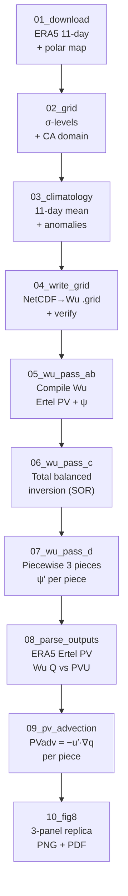

# PPVI Step-by-Step — Replicate Davis et al. Fig 8

## California Blocking Event (2025-01-08 00Z)

**What this is**: A fully self-contained, visual pipeline that runs the
Wu/Davis piecewise potential vorticity inversion (PPVI) on the Jan 8 2025
California blocking case. Every step produces diagnostic plots so you can
**see** what's happening — no black-box Fortran mysticism.

**Approach**: Following the Talia tutorial (`talia_tutorial/instructions.md`),
we use an **11-day time-mean** (Jan 3–13 2025 00Z) as the climatological
mean state. The perturbation = Jan 8 − 11-day mean. This is the standard
Davis & Emanuel (1991) method: the mean removes synoptic-scale background
while preserving the blocking anomaly.

## Pipeline



## Quick Start

```bash
cd /net/flood/data2/users/x_yan/pv_inversion/deepseek_step_by_step
micromamba run -n fourcastnetv2 python 01_download/download_era5.py
# ... continue through all 10 steps ...
# Or run all at once:
bash run_all.sh
```

## Step Overview

| # | Folder | What It Does | Key Viz |
|---|--------|-------------|---------|
| 01 | `01_download/` | Downloads 11 days of ERA5 (Jan 3–13 2025) at 00Z, 10 pressure levels, full NH | Z500 evolution polar map, 250 hPa wind field |
| 02 | `02_grid/` | Explains the 87×51 1.5° grid & σ-coordinate system. **Answers: why pressure levels, not model levels?** | σ-spacing diagram (good vs bad), grid points map |
| 03 | `03_climatology/` | Computes 11-day time-mean & anomaly fields. Data cleaning. | Z500 mean/anomaly, daily anomaly panels |
| 04 | `04_write_grid/` | Converts NetCDF → Wu ASCII `.grid` format. Verifies round-trip. | Side-by-side NetCDF vs .grid comparison |
| 05 | `05_wu_pass_ab/` | **Compiles Wu Fortran** (fresh!). Pass A: mean PV+ψ. Pass B: event PV+ψ. | Mean PV at 3 levels, PV anomaly, ψ at 500 hPa |
| 06 | `06_wu_pass_c/` | `qinvert21` — total balanced PV inversion via SOR. | Pass B vs Pass C ψ refinement, ψ at all 10 levels |
| 07 | `07_wu_pass_d/` | `qinvertp21` — piecewise perturbation inversion (3 pieces). | ψ′ at 250 hPa per piece, piece-3 noise diagnosis |
| 08 | `08_parse_outputs/` | Computes ERA5 Ertel PV in physical PVU. **Cross-compares Wu Q vs ERA5 PV** — the ~600× scaling. | Wu Q vs ERA5 PV side-by-side, induced winds |
| 09 | `09_pv_advection/` | PVadv = −u′·∇q in PVU/day per piece. Auto-scaled, piece-3 smoothed. | ∇q maps, PV advection per piece |
| 10 | `10_fig8/` | **The final 3-panel Davis Fig 8 replica**. Auto-scaled colors, contours, quivers. | `fig8_replica.png` + `.pdf` |

## Key Configuration

| Parameter | Value | Why |
|-----------|-------|-----|
| Grid | 87×51, 1.5° | CA domain: 10.5–85.5°N, 169.5°W–40.5°W |
| σ-levels (PR) | [1.0, 0.925, 0.85, 0.7, 0.6, 0.5, 0.4, 0.3, 0.25, 0.2] | Top at 200 hPa; uniform Δσ=0.05 at top → SOR stability |
| Climatology | 11-day mean (Jan 3–13 2025 00Z) | Removes synoptic background; preserves blocking anomaly |
| INLIN | 0 (linear balance) | INLIN=1 explodes at 250 hPa jet (ellipticity violation) |
| SOR | OMEGS=1.4, OMEGH=1.4, MAX=5000, MAXT=500 | Under-relaxed for 87×51 grid stability |
| PV for plotting | ERA5 Ertel PV (Python) | Wu Q is in opaque ~600× PVU — NOT used for physical plots |

## Environment

- **Python**: `micromamba run -n fourcastnetv2` (xarray, scipy, cartopy, cdsapi, matplotlib)
- **Fortran**: `gfortran -std=legacy -O2 -fno-automatic` (F77; `-fno-automatic` required for SAVE'd arrays)
- **HPC**: dolma (do NOT use `uv`, `uvx`, or `venv`)

## Output Files

```
data/
├── era5/          era5_2025-01-{03..13}_00Z.nc   (11 files, ~1 MB each)
├── clim/          mean_11day_jan2025.nc, event_jan08_2025.nc, anomaly_jan08_2025.nc
├── wu_in/         {mean,event}_{t,u,v,z}.grid    (8 ASCII files)
├── wu_bin/        pvpialln.exe, qinvert21.exe, qinvertp21.exe
├── wu_out/        piecewise_psi.nc, pv_advection.nc
└── figs/          fig8_replica.png, fig8_replica.pdf
```

## Known Bugs / Caveats

1. **Piece 3 (upper) gridpoint noise**: The rigid-lid SOR at 200 hPa leaks noise into 250 hPa. Gaussian σ=1.5 smoothing + 40 m/s wind cap mitigates in Python. True fix: Shapiro filter in Fortran at K≥NL−2.

2. **INLIN=1 explodes**: The PSI denominator `BSI·AC(3)−2·ASI·(SLL+SPP)` → 0 near the 250 hPa jet when nonlinear terms are included. Always use INLIN=0.

3. **Wu Q ≠ PVU**: Wu's `COEF=1E2*1E6*9.81*KAP*(CP**3.5)/P0` scales PV by ~600×. The spatial pattern is identical to ERA5 PV; only the magnitude differs.

4. **Non-uniform σ-spacing at top → blowup**: Going from σ=0.25 to 0.1 (100 hPa lid) makes the K=NL−1 SOR diverge regardless of iteration count. Keep top 3 levels equally spaced.
