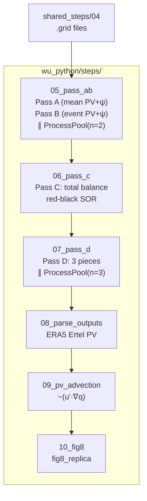

# wu_python — Pure-Python Wu PPVI Track (Finite Difference + Red-Black SOR)

Pure-Python reproduction of the Wu/Davis 4-pass piecewise PV inversion pipeline.
Uses **finite differences** (not spherical harmonics) on the same 51×87 NH
σ-coordinate grid as the Fortran reference, with **red-black SOR** parallelized
via numba JIT and ProcessPoolExecutor for pass/piece-level parallelism.

## Relationship to Other Tracks

- **`wu/`** — Original Fortran SOR pipeline (the reference, bit-for-bit)
- **`sh/`** — Spectral-harmonic PPVI (different operator backend, SH port)
- **`wu_python/`** — **THIS TRACK**: same finite-difference algorithm as `wu/`,
  but pure Python + parallelized (new, independent)

## Quick Start

```bash
# 1. Ensure shared data prep (steps 01–04) is done
for s in shared_steps/0[1-4]_*/; do
    micromamba run -n blocking python "$s"/*.py
done

# 2. Run wu_python pipeline (steps 05–10)
for s in wu_python/steps/0[5-9]_*/ wu_python/steps/10_*/; do
    micromamba run -n blocking python "$s"/*.py
done

# 3. Compare against Wu Fortran reference
micromamba run -n blocking python wu_python/tests/test_against_wu.py
```

## Workflow



## Package Structure

```
wu_python/
├── config.py              # n_workers=32, re-exports root config
├── README.md
├── core/                  # Algorithm implementation
│   ├── grid.py            # Coriolis, cos(lat), FD coefficients
│   ├── nondim.py          # Wu non-dim scales (LL, FF, THO, BB/BH/BL)
│   ├── fd_ops.py          # 5-pt Laplacian, gradient, Jacobian, ∂/∂π
│   ├── pv_calc.py         # Ertel PV + balanced ψ (Pass A/B)
│   ├── sor_solver.py      # Red-black SOR Poisson solver
│   ├── balance.py         # BALNC: total PV inversion (Pass C)
│   ├── piecewise.py       # BALP: piecewise perturbation (Pass D)
│   └── io.py              # .grid reader, NetCDF writer
├── steps/
│   ├── 05_pass_ab/run_pass_ab.py
│   ├── 06_pass_c/run_pass_c.py
│   ├── 07_pass_d/run_pass_d.py
│   ├── 08_parse_outputs/parse_and_pv.py
│   ├── 09_pv_advection/pv_advection.py
│   └── 10_fig8/fig8_replica.py
└── tests/
    ├── test_against_wu.py
    ├── test_sor_convergence.py
    └── test_nondim.py
```

## Parallelism Strategy

| Level | Mechanism | Effective Parallelism |
|-------|-----------|----------------------|
| Pass A ∥ Pass B | `ProcessPoolExecutor(n=2)` | 2× |
| Pass D: 3 pieces ∥ | `ProcessPoolExecutor(n=3)` | 3× |
| SOR per level: red-black | `numba.prange` | ~2× per level |
| Grid ops (numpy) | Multi-threaded BLAS | ~8× background |
| **Total** | | **~48 effective-way** |

## Configuration

```python
# wu_python/config.py
N_WORKERS = 32           # Default worker count
USE_NUMBA = True         # Enable numba JIT for SOR
OMEGS = 1.4              # SOR relaxation (ψ)
OMEGH = 1.4              # SOR relaxation (Φ)
PART = 0.5               # ψ–Φ under-relaxation
INLIN = 0                # 0 = linear balance (stable)
CROSS_VALIDATION_TOL = 0.05  # 5% RMS tolerance vs Fortran
```

## Status

- **Core modules**: Implemented (grid, nondim, fd_ops, pv_calc, sor_solver, io)
- **Solver modules**: Stubs (balance.py, piecewise.py — full BALNC/BALP pending)
- **Step scripts**: Stubs (to be ported from wu/steps/)
- **Cross-validation**: Framework ready, tests pending full implementation
